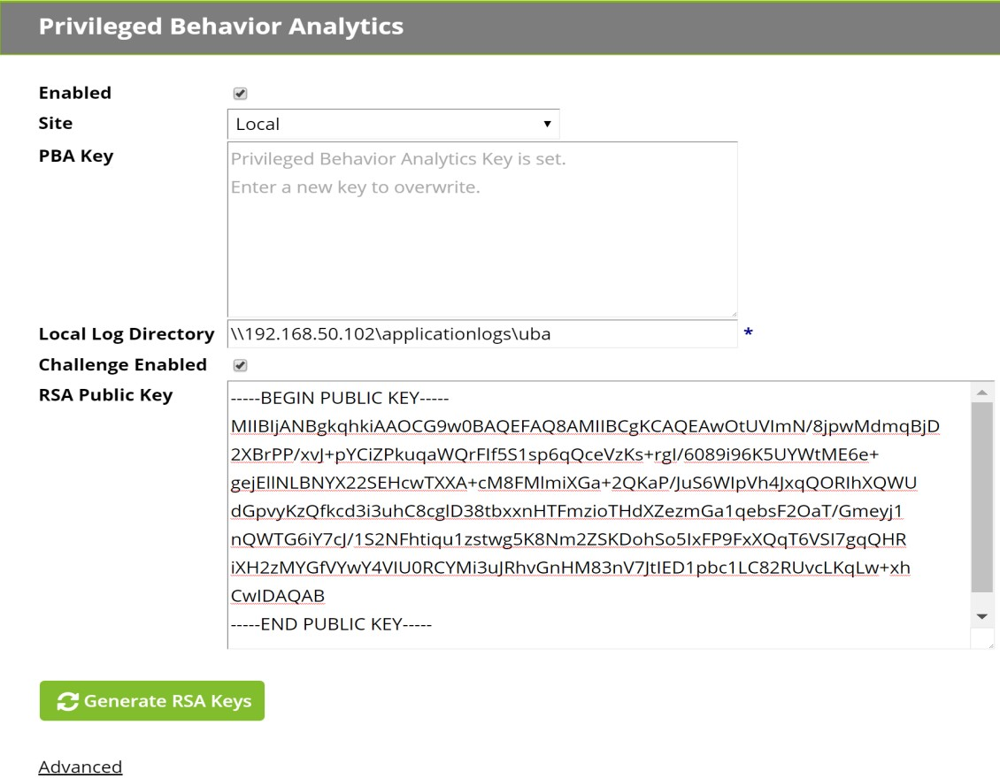
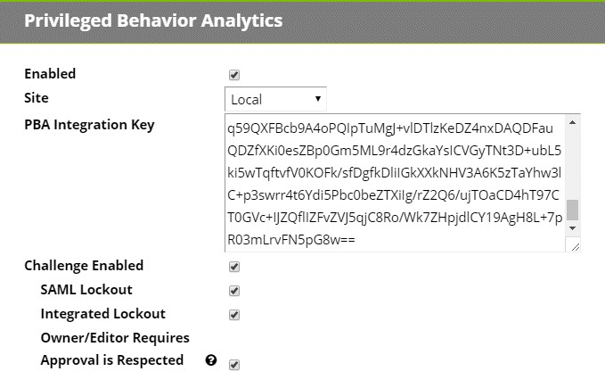
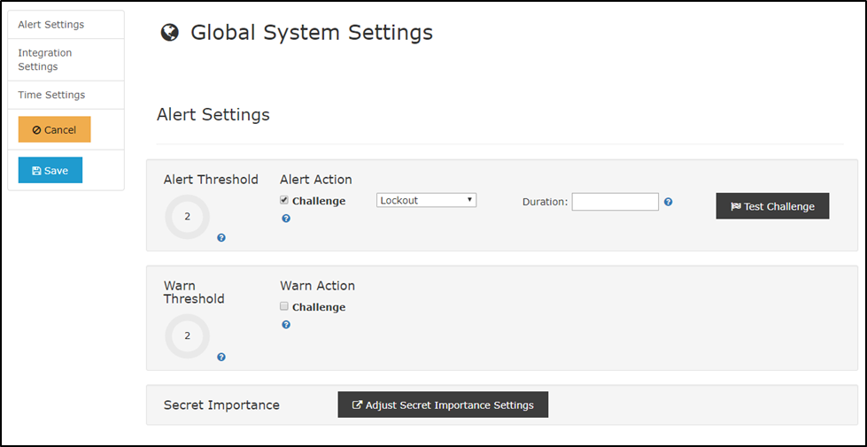
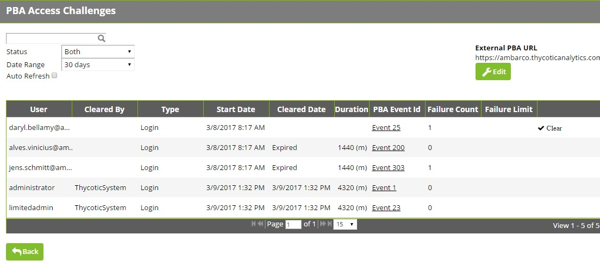

[title]: # (Access Challenges)
[tags]: # (Privileged Behavior Analytics,PBA,Access Challenges)
[priority]: # (3090)

# Access Challenges

Privileged Behavior Analytics can automatically issue **Access Challenges** on detection of anomalous behavior in Secret Server.

* Rule-based Challenges allow you to directly specify what qualifies as anomalous, for example, you can set a rule to issue a Challenge when a user’s risk level exceeds a pre-determined threshold.
* When PBA sends a Challenge to a Secret Server user, it suspends the user’s access to Secret Server. The user or an administrator must clear the Challenge for the user to regain access.

PBA can challenge only users with the Secret Server **Allow Access Challenge** Role permission. This Role permission applies by default to all users except those with the **Unlimited Administrator** role permission.

## Secret Server Configuration for Access Challenges

### Version 10.3.000015 and Earlier

Navigate to **\<SECRET SERVER\>/AdminAnalyticsEdit.aspx** and check **Challenge Enabled**. Generate a new RSA key pair and copy the public key before saving. This public key will be saved in PBA.

### Version 10.4.000000 and Later, Cloud

Navigate to **\<SECRET SERVER\>/AdminAnalyticsEdit.aspx** and check **Challenge Enabled**.

### Additional Settings

**SAML Lockout**: When this is set, authentication attempts via SAML can be blocked pursuant to a Lockout Challenge. If this setting is disabled, Lockout Challenges will apply only to non-SAML local authentication attempts where Secret Server is the identity provider. Thycotic recommends this setting be enabled.

**Integrated Lockout**: When this is set, authentication attempts via Active Directory can be blocked pursuant to a Lockout Challenge. If this setting is disabled, Lockout Challenges will apply only to non-AD local authentication attempts where Secret Server is the identity provider. Thycotic recommends this setting be enabled.

**Respect Owner/Editor Requires Approval**: This setting relates to Secrets subject to an **Owner Requires Approval** or **Editor Requires Approval** condition based on a global setting, a Secret Policy, or a setting in the Secret itself.

* If this setting is disabled, such **Requires Approval** conditions on a Secret *will not* be respected  during a **Requires Approval Access Challenge**.
* If this setting is enabled, such conditions *will* be respected during such a challenge.
  * **Example:** A user is an editor of a Secret, and the effective setting on the secret is *Editor Requires Approval=True*. However, the PBA setting to **Respect Owner/Editor Requires Approval** is not active. Therefore, when a **Requires Approval Access Challenge** is processed for this user, the user will be able to access the Secret despite being subject in Secret Server to an *Editor Requires Approval=True* condition.
    In this example, if the PBA setting *was* active, the user would need to request approval to access the secret until the Challenge is cleared, because PBA would respect the Secret Server *Editor Requires Approval=True* condition.
  * **Example:** A user is an editor of a Secret, and the effective setting on the secret is *Editor Requires Approval=False*. However, the PBA setting to **Respect Owner/Editor Requires Approval** settings is still not active. Therefore, when a **Requires Approval Access Challenge** is processed for this user, the user will *not* be able to access the Secret despite having in Secret Server an *Editor Requires Approval=False* condition, because PBA is not set to honor that setting.
  * In this example, if the PBA setting *was* active, the user would need to request approval to access the secret until the Challenge is cleared, because PBA would respect the Secret Server *Editor Requires Approval=True* condition.

## PBA Configuration for Access Challenges

Log into your PBA instance and navigate to **System Settings** by clicking on the cogwheel symbol at the top right of any PBA page and choosing **System Settings**.

Under **Global System Settings**, you can set triggers for Event Actions (an Alert or Warning) when conditions meet a certain risk threshold.

* Step only for Secret Server 10.3.000015 and earlier: Click **Edit** and paste your public key copied from Secret Server’s **AdminAnalyticsEdit.aspx** page into the Secret Server **Public Key** field. If you ever generate and save new keys, you must update the public key in PBA.

Currently, two simple rules may be set, a **Warning Threshold** and an **Alert Threshold**, with the Warning Threshold naturally lower than the Alert Threshold. For both, the supported **Event Action** is to challenge the user with a Secret Server **Access Challenge**.

In setting up a Challenge, you must specify the Challenge **Type**. Secret Server Version 10.2.000000 has only one Challenge Type:

* **Login**: the user must re-authenticate with Secret Server

Secret Server Versions 10.3.000015 and later have the **Login** Challenge Type, plus several more:

* **Two Factor**: the user must re-authenticate with Secret Server and the **Two Factor Remember Me** is expired (if set)
* **Require Aproval**: the user must request approval for accessing any Secrets unless
  * they are the only Approver for that Secret, *or*
  * they are the Owner or Editor; the Secret has *Editor/Owner Requires Approval* disabled; and PBA Configuration has *Respect Editor/Owner Requires Approval* enabled
* **Lockout**: the user is locked out from Secret Server until expiration of the Challenge or until it is cleared by an Admin user (a user having the **Administer Security Analytics** Role permission in Secret Server)

You must also specify the Challenge **Duration** in minutes.

* If Duration is set to 0 minutes, the Challenge will never expire and the target Secret Server user will be denied access until they or an Admin clears the Challenge.

### Access Challenge Administration

Challenges processed by Secret Server may be viewed and administered on **\<SECRET SERVER\>/AdminChallengeView.aspx**. This page is accessed by clicking the **Administer Challenges** button on **AdminAnalyticsView.aspx**.

* Challenges may be filtered by username and status (Cleared or Uncleared).
* If the External PBA URL is set, the **PBA Event Id** column will display a link to the Event Details page in PBA for the Event that triggered the Challenge.

The following additional columns are displayed:

* **Cleared By**: This is the user (if any) that cleared the Challenge.
  * For a Login Challenge, all of a user’s Secret Server sessions are ended and they must log into Secret Server successfully to clear the Challenge.
  * If a user does not have the **Allow Access Challenge** Role permissions in Secret Server, the Challenge will still be recorded, but will be listed as cleared by the **ThycoticSystem** user.
  * Finally, if an Administrator clears a Challenge on this page, that Administrator’s username will be listed.
* **Type**: This is the Challenge Type as specified in the rule configured in PBA.
* **Start Date**: The time that an Event occurred in PBA and triggered the Challenge Event Action.
* **Cleared Date**: The date (if ever), the Challenge was cleared. If the Challenge has not been cleared, but Duration (in minutes) has passed, the Challenge will be listed as **Expired**.
* **Failure Count**: The number of times the user failed to clear the challenge, such as by failing to successfully authenticate.
* **Clear Button**: This is visible if you have the **Administer Security Analytics** Role permission in Secret Server. It allows you to clear a Challenge for another user.

### Access Challenge Security

Because Access Challenge affects Secret Server user access from an external system, the architecture is heavily focused on security.
