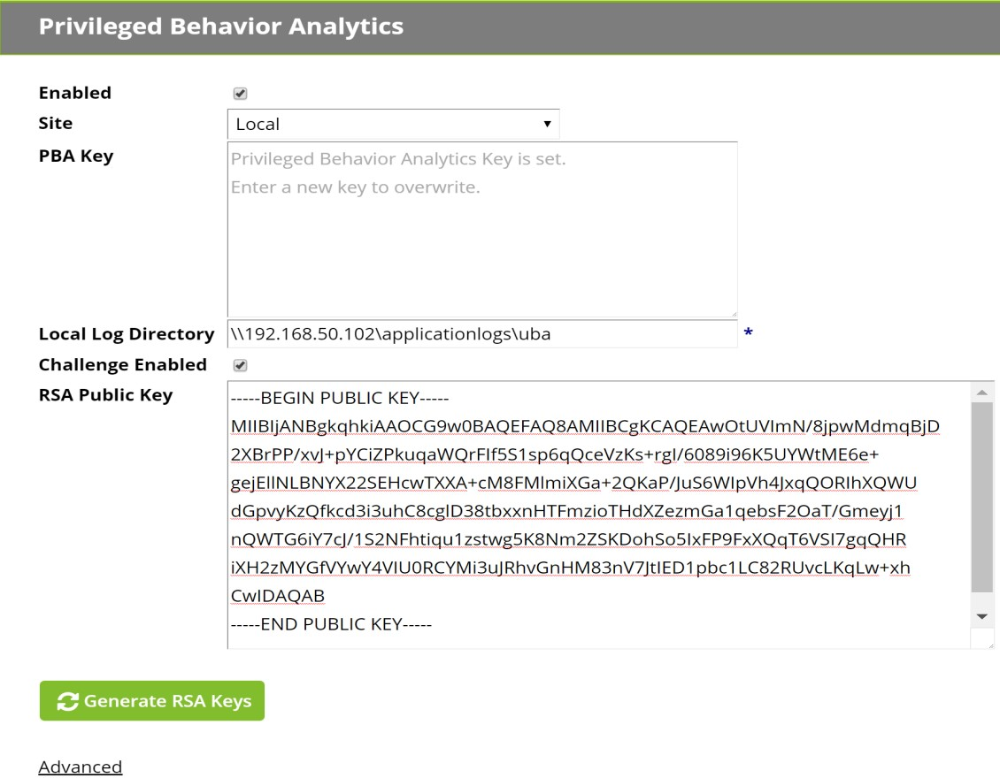
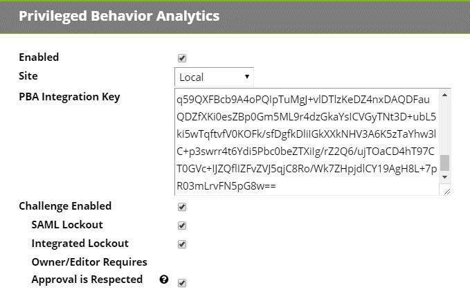

[title]: # (Getting Started)
[tags]: # (Privileged Behavior Analytics,PBA,)
[priority]: # (3000)

# Getting Started
Privileged Behavior Analytics resides on the Amazon AWS platform as a Cloud application. To use PBA requires no hardware installation and no COTS installation on your premises. However, it does require that you configure Secret Server to send metadata to Privileged Behavior Analytics, and this process is highly version-dependent.
This section details the required setup steps.
## Requirements
Requirements include:
* Secret Server Installed v10.2 *or* Secret Server Cloud
* Secret Server Professional edition *or higher*
* Received an email with your Privileged Behavior Analytics account login information – This will be provided after you have purchased or been approved for a trial of Privileged Behavior Analytics
* Single Sign On requires Secret Server v10.4
## Secret Server Configuration
Secret Server provides data to Privileged Behavior Analytics through the Data Uploader, which requires version dependent configuration.
### Data Uploader Setup Steps
#### Version 10.3.000015 and Earlier
Privileged Behavior Analytics (PBA) processes event data from Secret Server using a data upload.
First obtain the Integration Key from PBA that will be used by Secret Server to authenticate with and upload data to PBA. Log in to your PBA instance and navigate to **\<PBA\>/system_settings.** Click on **View Integration Key** and copy this key.
If you are prompted whether Secret Server is on version 10.4.000000 or later, click *No*.

After copying the integration key, open Secret Server and navigate to **\<SECRET SERVER\>/AdminAnalyticsView.aspx**. This page is linked on **Administration.aspx** as Privileged Behavior Analytics. You should see the following screen:

Click **Edit**. On the next screen, **AdminAnalyticsEdit.aspx**, you will enter your PBA key under the **PBA Key** field.
The PBA Key contains the secret access key and other parameters for uploading data to Thycotic PBA. The key is encrypted (for protection in transit). When you enter the key into Secret Server, it is encrypted and saved using your standard Secret Server encryption (AES-256 and DPAPI/HSM if configured).
The key can never be loaded again through the UI, but can be updated in case the linked Thycotic PBA account needs to be changed.

You will also need to specify the following fields:
**Enabled**: Enable Privileged Behavior Analytics.
**Site**: Set to Local by default, this will process and upload event logs using your IIS server running Secret Server (the default for your local site). If you are also using **Distributed Engine** [y](https://thycotic.force.com/support/s/article/ka0370000005QDvAAM/Distributed-Engine)ou can specify a remote site and upload event data to PBA via Engines. This option is useful if you want to offload the work or if you prefer to allow an outbound firewall rule to the PBA servers from an Engine rather than from the server running Secret Server.
**Local Log Directory:** Event logs are stored on a local drive or network drive before being uploaded to cloud storage. Secret server or your Distributed Engines (depending on whether you specify a local or remote site in the previous setting) must have write access to this local directory or network drive location.
*IMPORTANT FOR CLUSTERED ENVIRONMENTS:* **This setting is the same for all IIS nodes or engines on a given site.** Thus. If you enable background worker on multiple web nodes (see Background Worker section below), and specify C:\\logs\\uba, then you will need to create this same directory on each of your web node servers and ensure each Secret Server installation (web node) can write to its respective local directory. The same applies to a remote site with more than one distributed engine; each of the distributed engine’s host machine must have a directory by this name, or have access to the network share if used.
**Challenge Enabled**: Enable Secret Server Access Challenges. See Access Challenge for further information.
You may also click on **Advanced** to change additional settings:
**Encrypt (At Rest):** Encrypt event logs at rest in cloud storage. This is enabled by default and the recommendation is to keep it enabled. Performance improvements from disabling it are negligible.
**External PBA URL**: This is the URL of your Privileged Behavior Analytics cloud instance. It must be set manually and will change the PBA links in the Tools menu and Setup Home page to direct to your cloud instance in a new tab, instead of directing to this configuration page in Secret Server. Setting to your PBA URL will also convert the PBA Event Id column on **AdminChallengeView.aspx** to clickable links (see Access Challenge for further information).
**Upload Frequency – Event Logs**: The frequency that event logs are uploaded to PBA. The recommend interval is 5 minutes. The minimum interval is 2 minutes.
**Upload Frequency – Metadata Logs**: The frequency that metadata is uploaded to PBA. The recommended interval is at least 60 minutes. The minimum interval is 5 minutes. Metadata frequency should vary based on how often new Users and Secrets are added in Secret Server, typically it should not need to be less than 60 minutes.
**Upload Frequency – Size Threshold**: You may also specify a maximum size threshold that will trigger an early upload before the temporal threshold (in minutes) is met. Because event logs and metadata are compressed prior to upload, the size threshold will not frequently be met (it safeguards against accumulating too many logs and experiencing processing delays).
**Local Retention:** This is the number of days that your event logs and metadata are stored in the local log directory specified. **All historic event logs are maintained in the PBA database until account deletion.** It is good practice to set this threshold to at least 7 days because if there is a connectivity issue between Secret Server and PBA, any event logs younger than the **Local Retention** setting will be uploaded upon re-connection.
When the configuration on **AdminAnalyticsEdit.aspx** is saved and PBA is set to enabled, the configuration is validated. It can also be manually validated by clicking **Test PBA Key** on **AdminAnalyticsView.aspx**.
#### Version 10.4.000000 and Later, Cloud
Privileged Behavior Analytics (PBA) processes event data from Secret Server using a data upload. As of Secret Server Installed version 10.4 and for Secret Server Cloud, event data is uploaded to PBA via queues and micro-loading, and is closer to real-time. Prior versions of Secret Server data upload followed the more typical data warehouse design of file upload and small batch-loading.
*If PBA is already enabled in Secret Server prior to upgrading to version 10.4.000000 or later, the below steps must be followed (copying the integration key from PBA to Secret Server) in order to enable Single Sign On. Single Sign On requires a key exchange in order for PBA to use Secret Server as an identity provider, and a new integration key is provided with PBA’s public key in order to initiate this key exchange.*
First obtain the Integration Key from PBA that will be used by Secret Server to authenticate with and upload data to PBA. Log into your PBA instance and navigate to **\<PBA\>/system_settings.** Click on **View Integration Key** and copy this key. If you are prompted to specify whether Secret Server is on version 10.4.000000, click *Yes.*

After copying the integration key, open Secret Server and navigate to **\<SECRET SERVER\>/AdminAnalyticsView.aspx.** This page is linked to on Administration.aspx as **Privileged Behavior Analytics**. You should see the following screen:

Click **Edit**. On the next screen, **AdminAnalyticsEdit.aspx**, you will enter your PBA key under the **PBA Key** field.
The **PBA Key** contains the secret access key and other parameters for uploading data to **Thycotic PBA.** The key is encrypted (for protection in transit). When you enter the key into Secret Server, it is encrypted and saved using your standard Secret Server encryption (AES-256 and DPAPI/HSM if configured). The key can never be loaded again through the UI, but can be updated in case the linked Thycotic PBA account needs to be changed.
You will also need to specify the following fields:
**Enabled**: Enable Privileged Behavior Analytics.
**Site**: Set to Local by default, this will process and upload event logs using your IIS server running Secret Server (the default for your local site). If you are also using Distributed Engine [y](https://thycotic.force.com/support/s/article/ka0370000005QDvAAM/Distributed-Engine)ou can specify a remote site and upload event data to PBA via Engines. This option is useful if you want to offload the work or if you prefer to allow an outbound firewall rule to the PBA servers from an Engine rather than from the server running Secret Server.
**Challenge Enabled**: Enable Secret Server Access Challenges. See section Access Challenge for further information on this setting and its sub-options.
You may also click on **Advanced** to change additional settings:

**External PBA URL**: This is the URL of your Privileged Behavior Analytics cloud instance. It is set automatically by the integration key but may be overridden. This URL is used for Single Sign On, for redirecting to PBA from the Tools menu, and on **AdminChallengeView.aspx** to create links to the PBA events that spawned Access Challenges (see Access Challenge for further information).
**Metadata Interval (Installed Only)**: The frequency that metadata is uploaded to PBA. The recommended interval is at least 60 minutes. The minimum interval is 5 minutes. Metadata frequency should vary based on how often new Users and Secrets are added in Secret Server, typically it should not need to be less than 60 minutes. *For Cloud, this setting is unavailable and defaults to 60 minutes.*
When the configuration on **AdminAnalyticsEdit.aspx** is saved and PBA is set to enabled, the configuration is validated. It can also be manually validated by clicking **Test PBA Key** on **AdminAnalyticsView.aspx**
### Proxied Environments
If the Secret Server has outbound access through a proxy, its web.config must be modified to specify the proxy configuration. Note that if Secret Server is also clustered and has multiple worker roles enabled (see the following Background Worker section), each Secret Server’s web.config must be updated. (Further explanation here: [https://docs.microsoft.com/en-us/dotnet/framework/configureapps/file-schema/network/defaultproxy-element-network-settings)](https://docs.microsoft.com/en-us/dotnet/framework/configure-apps/file-schema/network/defaultproxy-element-network-settings)
The other option in a clustered environment is to specify a remote site for the data upload, and upload data through a distributed engine. If the distributed engine’s host server is also behind a proxy, however, the engine’s Thycotic.DistributedEngine.Service.exe.config must be modified similarly to the web.config in order to specify the proxy settings.
For Secret Server v10.4 or later, the web-proxy.config can be uncommented and updated to specify the proxy settings.
For Secret Server v10.3.000015 or earlier, the following XML should be added to the web.config immediately following the closing \</configSections\> tag:
\<SYSTEM.NET\> \<DEFAULTPROXY ENABLED="TRUE" USEDEFAULTCREDENTIALS="TRUE"\> \<PROXY USESYSTEMDEFAULT="FALSE"
PROXYADDRESS="HTTPS://PROXY:PORT"
BYPASSONLOCAL="TRUE" /\> \</DEFAULTPROXY\> \</SYSTEM.NET\>
The resulting web.config will be as follows:
\</CONFIGSECTIONS\> \<SYSTEM.NET\> \<DEFAULTPROXY ENABLED="TRUE" USEDEFAULTCREDENTIALS="TRUE"\> \<PROXY USESYSTEMDEFAULT="FALSE"
PROXYADDRESS="HTTPS://PROXY:PORT "
BYPASSONLOCAL="TRUE" /\> \</DEFAULTPROXY\> \</SYSTEM.NET\> \<CONFIGURATION TYPE="THYCOTIC.FOUNDATION.CONFIGURATION, THYCOTIC.FOUNDATION"\>
### Historical Data Import
When Privileged Behavior Analytics is first enabled, you have the option to import the past thirty days of historical event data. Importing historical data allows PBA to jump start the learning period and begin analyzing user behavior from day one (assuming Secret Server has been installed long enough to meet the learning period requirement).
While event data is not persisted in Secret Server, events are derived from audit data, which is persisted.
Only thirty days of historical event data is imported by default because this is typically the most relevant data for learning about user behavior. *If you wish to import more than thirty days of historical data, please contact Thycotic Support for assistance.*

Select **OK** to import thirty days of historical data, **Don’t Ask Again** to permanently dismiss the dialog, and **Remind Me Later** to prompt again the next time you save Privileged Behavior Analytics configuration with PBA enabled. If you select **Remind Me Later** and come back to import historical data at a later date, the same time range will be used for the import (the thirty days immediately prior to the first date that PBA was enabled). This ensures data continuity.
After clicking **OK** to begin the import, you will see the below dialog with the number of events to be imported and a time estimate for processing the events. All events are immediately queued for processing and must pass through the data pipeline for upload to Privileged Behavior Analytics. For Secret Server v10.3.000015 and earlier, please note that the **Event Log Upload Frequency** may affect the total processing time (lower interval will decrease the time and greater interval will increase the time).

### Background Worker (Clustered Environments)
After enabling Privileged Behavior Analytics on **AdminAnalyticsEdit.aspx** and clicking **Save**, navigate to **AdminClustering.aspx** and ensure that at least one of your web nodes has the **Background Worker** column enabled (see below).
Background Worker is a concept added in version 10.1.000000 that allows specification of which Secret
Server nodes run background tasks. Prior to 10.1.000000, all nodes process web requests, but only the
Primary Node runs background tasks. This architectural redesign is nearing completion as of Secret Server version 10.4.000000 and greatly improves the scalability, flexibility and reliability of a clustered installation in enterprise environments.

## Privileged Behavior Analytics Configuration
In Privileged Behavior Analytics, the **User Settings** allow password changes and specifying per-user alert notification settings. **System Settings** allow the configuration of Secret Server integration, global alert and challenge callback, and time settings in PBA.
You can navigate to User Settings by clicking on the cogwheel symbol at the top right of any Privileged Behavior Analytics page and choosing **User Settings**.

**Account Settings –** Lets you change the password on your account used to access Privileged Behavior Analytics.
**Alert Notification Settings –** You can set the email address you wish to receive any alerts at and whether you want to receive alerts and/or warnings as they occur.
You can navigate to System Settings by clicking on the cogwheel symbol at the top right of any Privileged Behavior Analytics page and choosing **System Settings**.

**Alert Threshold –** The numerical value an alert needs to meet or exceed to send an email.
**Alert Action –** Whether you wish to Challenge a Secret Server User if their actions cause Privileged Behavior Analytics to generate an alert for them that meets or exceeds the Alert Threshold. To use Challenges, you must configure it on Secret Server as well. More information on the configuration can be found in the following Access Challenge section.
**Warn Threshold –** The numerical value a warning needs to meet or exceed to send an email.
**Warn Action –** Whether you wish to Challenge a Secret Server User if their actions cause Privileged Behavior Analytics to generate a warning for them that meets or exceeds the Warn Threshold.
**Secret Importance –** Brings you to a page that lists all of your Secrets and lets you change any of their importance settings in Privileged Behavior Analytics.

**View Integration Key –** This key is copied to Secret Server and provides access information for Secret Server to authenticate with, and upload data to, Secret Server
**Version 10.4.000000 and Later:**
>   **PBA Key Pair / Secret Server Key Pair** – Key exchange is used by PBA during Single Sign On in order to verify Secret Server’s (as an identity provider) user claims. In the opposite direction, it is used by Secret Server as an additional layer of security to verify that Access Challenges were signed by the authorized PBA instance.
>   **Initiate Key Rotation –** PBA initiates a key rotation in which both Secret Server and PBA generates a new key pair, and exchange the new public key with each other, using the last public key to sign this new exchange. Keys are typically rotated periodically in various systems as a security best practice.
>   **Clear Keys** – CAUTION - This is only used when migrating from one Secret Server instance to a completely new Secret Server instance (and using the same PBA instance), or when troubleshooting issues with key exchange. This clears all key pairs (both Secret Server and PBA) from PBA’s database. After clearing, the integration key is copied to the target Secret Server and the initial key exchange is conducted, as with a fresh configuration of PBA-Secret Server integration.
**Version 10.3.000015 and Earlier**
>   **Edit Secret Server Public Key –** The public key from /AdminAnalyticsEdit.aspx in Secret Server must be copied to PBA and saved in order to use Access Challenges
## Single Sign-On (Version 10.4 and Later, Cloud)
As of version 10.4.000000, Secret Server can act as an identity provider for Secret Server. Any user with the *View Security Analytics* role permission in Secret Server may log into PBA. Additionally, any user with *Administer Security Analytics* role permission is able to perform administrative actions once logged into PBA through Single Sign-On (SSO). Local PBA users (the initial users prior to integrating PBA into Secret Server) still have administrative rights as well.
No additional configuration is typically needed in order for SSO to start working. You must verify on both
**\<SECRET SERVER\>/AdminAnalyticsView.aspx** and **\<PBA\>/system_settings** pages that both the PBA and Secret Server key pairs are **Confirmed** status (on both pages). This key exchange is used for verification of Secret Server as an identity provider, as explained below.

In order to verify that the SSO claim was signed by Secret Server, PBA must have a copy of Secret Server’s public key. Version 10.4.000000 has infrastructure for key exchange and rotation between Secret Server and PBA. When the integration key is first copied from PBA and saved to Secret Server, it contains PBA’s initial public key. Secret Server then generates its own key pair and sends its public key to PBA, which registers Secret Server’s public key and sends confirmation back to Secret Server.
When a key rotation is initiated, PBA generates a new key pair and sends a signed initiate request to Secret Server, and the rest of the process is the same as the initial key exchange, except that each message is signed and verified during the rotation.
**Troubleshooting** – If Secret Server shows that its Key Pair is **Pending Confirmation** status, or PBA shows the same status for its key pair, both Secret Server and PBA have a **Resend Confirmation** button to attempt to address this. For example, if in Secret Server its key pair is **Pending**, then you would click the **Resend Confirmation** button in PBA, so that PBA will retry communicating to Secret Server that PBA did register Secret Server’s latest public key. And vice versa.
## Access Challenge
 In Privileged Behavior Analytics, Access Challenges are a way to automate reactive actions to the detection of anomalous behavior in Secret Server. Rule-based Challenges can be configured, such as when a user’s risk level exceeds a pre-determined threshold. After a Challenge is sent to Secret Server, it must be cleared by that user or by an Administrator before the user may continue using Secret Server.
Only users with the 'Allow Access Challenge' role permission in Secret Server may be challenged. By default, this role permission is given to all users except those with the Unlimited Administrator role permission.
### Secret Server Configuration
#### Version 10.3.000015 and Earlier
Navigate to **\<SECRET SERVER\>/AdminAnalyticsEdit.aspx** and check **Challenge Enabled**. Generate a new RSA key pair and copy the public key before saving. This public key will be saved in PBA.

#### Version 10.4.000000 and Later, Cloud
Navigate to \<SECRET SERVER\>/AdminAnalyticsEdit.aspx and check Challenge Enabled.

##### Additional Settings
SAML Lockout – If SAML is enabled and a Lockout challenge is received, authentication attempts via SAML will be blocked. If this setting is disabled, logins are only blocked when Secret Server is the identity provider (for non-SAML, local authentication attempts). The recommendation is to enable this setting.
Integrated Lockout – If Integrated Authentication is enabled and a Lockout challenge is received, authentication attempts via Active Directory will be blocked. If this setting is disabled, logins are only blocked when Secret Server is the identity provider (for non-AD, local authentication attempts). The recommendation is to enable this setting.
Owner/Editor Requires Approval is Respected – When the *Owner Requires Approval* or *Editor Requires Approval* settings are set for a Secret (either through the global setting on Configuration.aspx or from the Secret Policy or directly on the Secret), enabling this PBA setting will respect the effective Secret Server *Requires Approval* setting during a Requires Approval Access Challenge.
Example: A user is an editor of secret, and the effective setting on the secret is *Editor*
*Requires Approval=True*. If we enable this PBA setting, then when a Requires Approval
Access Challenge is processed for this user, the user will still be able to access the secret
without approval. If we set this PBA setting to false, in the above scenario, the Secret Server *Editor Requires Approval* setting for the secret is overridden, and the user must request access for the secret until the Challenge is cleared.
### Privileged Behavior Analytics Configuration
Log into your Privileged Behavior Analytics instance and navigate to System Settings by clicking on the cogwheel symbol at the top right of any Privileged Behavior Analytics page and choosing **System Settings**. Under **Global System Settings**, rules can be set up to trigger an Event Action (Alert or Warning) when a certain risk-level threshold is met.
*Only for Secret Server version 10.3.000015 and earlier. For 10.4.000000 and later, proceed to 3*
*Click Edit and paste your public key copied from Secret Server’s AdminAnalyticsEdit.aspx page into the Secret Server Public Key field. If you ever generate and save new keys, you must update the public key in PBA.*
Currently, two simple rules may be set, an **Alert Threshold** and a **Warning Threshold**. The Warning Threshold will by nature be lower than the Alert Threshold. And the current Event Action that is supported is **Challenge** (Secret Server Access Challenge).
Specify the Challenge **Type** Version 10.2.000000
**Login** – User must re-authenticate with Secret Server
Version 10.3.000015 and Later
**Login** – User must re-authenticate with Secret Server
**Two Factor** – User must re-authenticate with Secret Server and the Two Factor Remember Me is expired if set
**Require Aproval –** User must request approval for accessing any secrets unless they are the only Approver for that secret, or if they are the Owner or Editor and both the Secret has *Editor/Owner Requires Approval* setting disabled **AND** PBA configuration has *Respect Editor/Owner Requires Approval* enabled
**Lockout** – User is locked out from Secret Server until expiration of the Challenge or until it is cleared by a user with the Administer Security Analytics role permission
Specify the Challenge **Duration** (in minutes). If Duration is set to 0 minutes, the Challenge will never expire, and the target Secret Server user will be denied access until that user or an Administrator (user with ‘Administer Security Analytics’ role permission in Secret Server) clears the Challenge.

### Access Challenge Administration
Challenges processed by Secret Server may be viewed and administered on **\<SECRET SERVER\>/AdminChallengeView.aspx**. This page is accessed by clicking the **Administer Challenges** button on **AdminAnalyticsView.aspx**.

Challenges may be filtered by username and status (Cleared or Uncleared). If the External PBA URL is set, the **PBA Event Id** column will display a link to the Event Details page in PBA for the Event that triggered the Challenge.
The following additional columns are displayed:
**Cleared By:** The user (if any) that cleared the Challenge. For Login Challenge, all of a user’s Secret Server sessions are ended and they must log into Secret Server successfully to clear the Challenge. If a user does not have ‘Allow Access Challenge’ role permission in Secret Server, the
Challenge will still be recorded, but will be listed as Cleared By ThycoticSystem user. Finally, if an
Administrator clears a Challenge on this page, that Administrator’s username will be listed
**Type:** The Challenge Type, as specified in the rule configured in PBA.
**Start Date:** The time that an Event occurred in PBA and triggered the Challenge Event Action.
**Cleared Date:** The date (if ever), the Challenge was cleared. If the Challenge has not been cleared, but Duration (in minutes) has passed, the Challenge will be listed as ‘Expired’
**Failure Count:** The number of times the user failed to clear the challenge, such as failed login.
**Clear Button:** This if visible if you have ‘Administer Security Analytics’ role permission in Secret Server. This allows you to clear a Challenge for another user.
### Access Challenge Security
Because Access Challenge affects Secret Server user access from an external system, the architecture is heavily focused on security.
