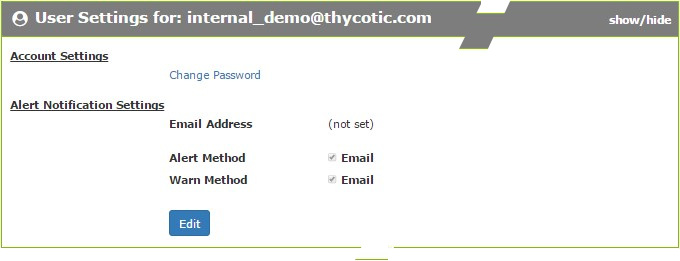
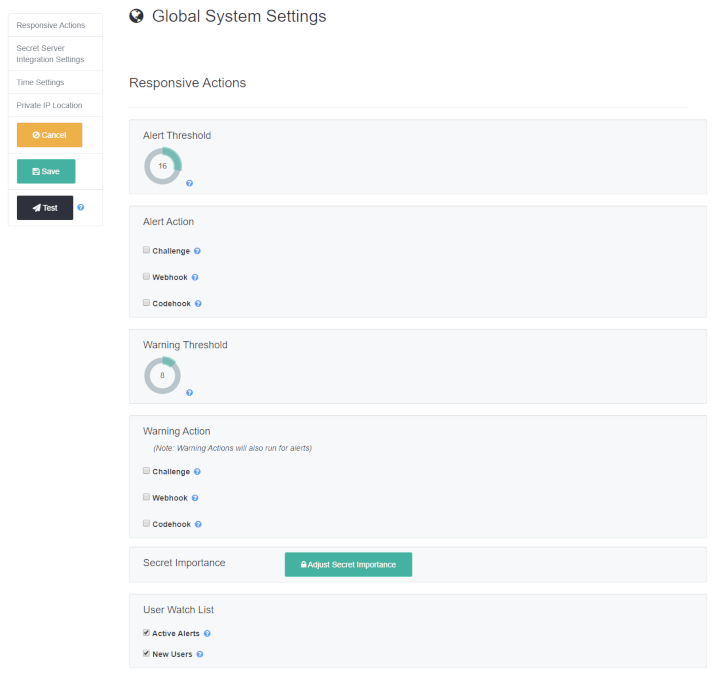
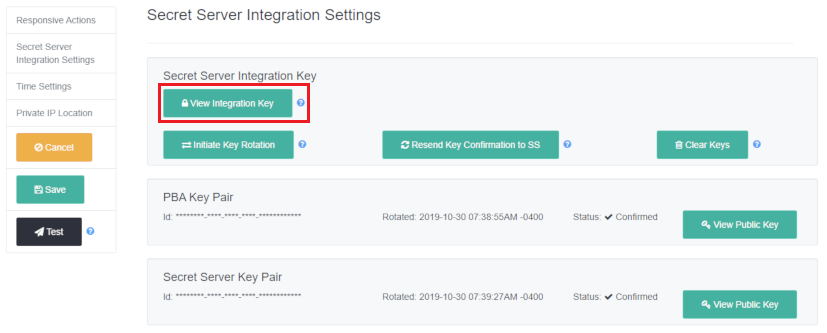

[title]: # (PBA Configuration)
[tags]: # (Privileged Behavior Analytics,PBA,)
[priority]: # (3070)

# Privileged Behavior Analytics Configuration

In PBA, the **User Settings** allow password changes and configuration of per-user alert notifications. The **System Settings** allow the configuration of Secret Server integration, global alert and challenge callback, and time settings.

## User Settings

You can navigate to **User Settings** by clicking the cogwheel symbol at the top right of any PBA page and choosing **User Settings**.

**Account Settings**: Lets you change the password on your account used to access PBA.

**Alert Notification Settings**: You can set the email address to receive alerts and specify whether you want to receive alerts and warnings as they occur.

## System Settings

You can navigate to **System Settings** by clicking on the cogwheel symbol at the top right of any PBA page and choosing **System Settings**.

**Alert Threshold**: The numerical value an alert needs to meet or exceed to send an email.

**Alert Action**: Whether you wish to Challenge a Secret Server User if their actions cause PBA to generate an alert for them that meets or exceeds the Alert Threshold. To use Challenges, you must configure it on Secret Server as well. More information on the configuration can be found in the following Access Challenges section.

**Warn Threshold**: The numerical value a warning needs to meet or exceed to send an email.

**Warn Action**: Whether you wish to Challenge a Secret Server User if their actions cause PBA to generate a warning for them that meets or exceeds the Warn Threshold.

**Secret Importance**: Brings you to a page that lists all of your Secrets and lets you change any of their importance settings in PBA.

**User Watch List**: Check the boxes to automatically watchlist users with active alerts and warnings or new users.  If the status of the user changes (for example, their active alert is cleared, or a new user reaches 30 days), then the user will be automatically removed from the User Watch List.

**View Integration Key**: This key is copied to Secret Server and provides access information for Secret Server to authenticate with and upload data to PBA.

* **Version 10.4.000000 and Later**
  * **PBA Key Pair / Secret Server Key Pair:** Key exchange is used by PBA during Single Sign On in order to verify Secret Server’s (as an identity provider) user claims. In the opposite direction, it is used by Secret Server as an additional layer of security to verify that Access Challenges were signed by the authorized PBA instance.
  * **Initiate Key Rotation:** PBA initiates a key rotation in which both Secret Server and PBA generate a new key pair and exchange the new public key with each other using the last public key to sign this new exchange. Keys are typically rotated periodically as a security best practice.
  * **Clear Keys**: This is used *only* when migrating from one Secret Server instance to a completely new Secret Server instance while using the same PBA instance *or* when troubleshooting issues with key exchange.
    CAUTION: This clears all key pairs (both Secret Server and PBA) from PBA’s database. After clearing, the integration key is copied to the target Secret Server and the initial key exchange is conducted, the same as with a fresh configuration of PBA-Secret Server integration.
* **Version 10.3.000015 and Earlier**
  * **Edit Secret Server Public Key**: The public key from **/AdminAnalyticsEdit.aspx** in Secret Server must be copied to PBA and saved in order to use Access Challenges.
