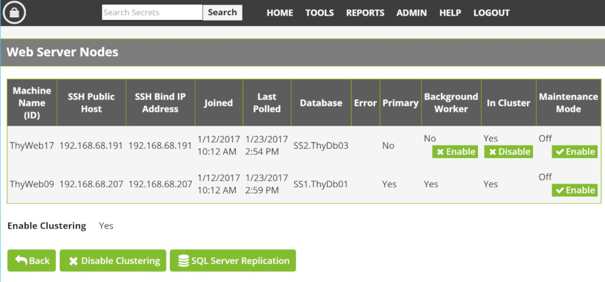

[title]: # (Background Worker)
[tags]: # (Privileged Behavior Analytics,PBA,Background Worker,Cluster)
[priority]: # (3060)

# Background Worker (Clustered Environments)

After enabling PBA, navigate to **AdminClustering.aspx** and ensure that at least one of your web nodes has the **Background Worker** column enabled, as below.

* In Secret Server versions prior to 10.1.000000, all nodes process web requests, but only the Primary Node runs background tasks.
* In 10.1.000000 and later, the Background Worker feature allows you to specify the Secret Server nodes that run background tasks.

