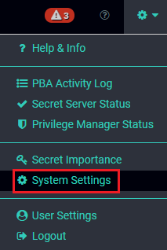
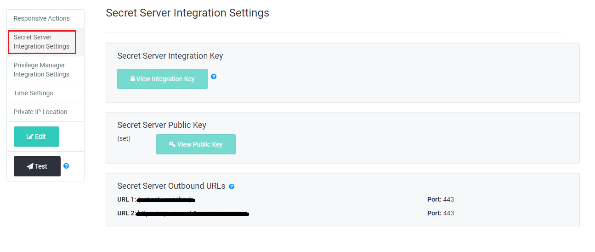
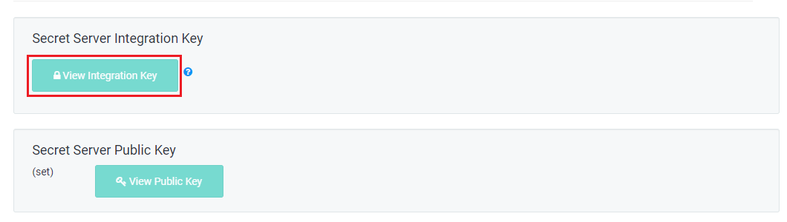
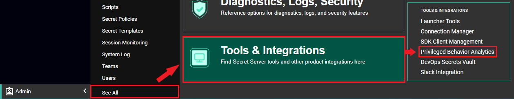
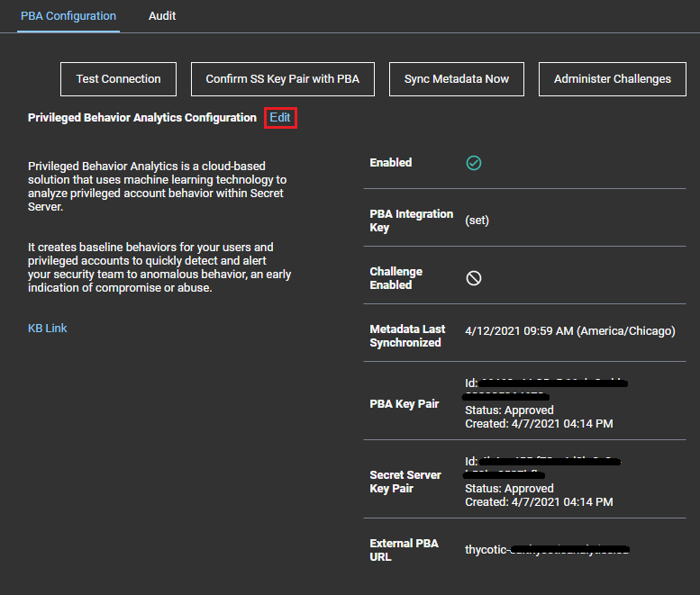
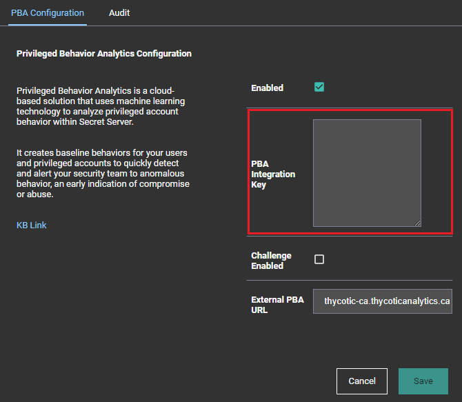

[title]: # (Data Uploader Setup)
[tags]: # (secret server)
[priority]: # (3030)

# Data Uploader Setup Steps

Privileged Behavior Analytics (PBA) processes event data from Secret Server using a data upload. The Data Uploader setup steps depend on your Secret Server version.

Integrating Secret Server and PBA requires an **Integration Key**. This key:  
* contains the secret access key and other parameters for uploading data to Thycotic PBA.
* is encrypted for protection in transit.
* is encrypted and saved when entered into Secret Server using standard Secret Server encryption (AES-256 and DPAPI/HSM if configured).
* can never be loaded again through the UI, but can be updated if the linked PBA account needs to be changed.

## Version 10.4 and Later, and Cloud

For Secret Server Installed Version 10.4 and for Secret Server Cloud, event data is uploaded to PBA via queues and micro-loading, and is closer to real-time. Prior versions of Secret Server data upload followed the more typical data warehouse design of file upload and small batch-loading.

Use these steps to obtain the Integration Key from PBA that will be used by Secret Server to authenticate and upload data to PBA:

1. Log into your PBA instance and click the gear in the upper right-hand corner. From the drop-down, select **System Settings**.

    

1. From the **Global System Settings** left-hand navigation menu, click **Secret Server Integration Settings**.

    

1. Click **View Integration Key**. If you are prompted to specify whether Secret Server is on version 10.4.000000, click *Yes.*

    

1. Copy the **Integration Key Value**.
1. Open Secret Server and navigate to **Admin > See All > Tools & Integrations > Privileged Behavior Analytics**. 

    

1. On the PBA Configuration page, click **Edit**.

    

1. Check **Enabled** to enable Privileged Behavior Analytics.
1. Paste the **PBA Integration Key** that you copied in step 4.

    

1. Check **Challenge Enabled** to enable Secret Server Access Challenges. See the [Access Challenges](../access-challenges.md) article for further information. 
1. Input the **External PBA URL**. This is the URL of your Privileged Behavior Analytics cloud instance. **It is set automatically by the integration key but may be overridden.** It is used for Single Sign On, redirecting to PBA from the Tools menu, and on the **Access Challenges** page to create links to the PBA events that spawned Access Challenges.
1. Set the **Metadata Interval (Installed Only)**. The frequency that metadata is uploaded to PBA.
    * The recommended interval is at least 60 minutes.
    * The minimum interval is 5 minutes.
    * Metadata frequency should vary based on how often new Users and Secrets are added in Secret Server; typically it should not need to be less than 60 minutes.
    * For Cloud, this setting is unavailable and defaults to 60 minutes.
1. Click **Save** to confirm the configuration.
1. When the configuration is saved and PBA is set to enabled, the configuration will be validated. It can also be manually validated by clicking **Confirm SS key Pair with PBA**.

### Special Case: PBA Already Enabled

If PBA was already enabled in Secret Server prior to upgrading to version 10.4.000000 or later, you must copy the integration key from PBA to Secret Server in order to enable Single Sign On.

Single Sign On requires a key exchange in order for PBA to use Secret Server as an identity provider, and a new integration key is provided with PBA’s public key in order to initiate this key exchange.