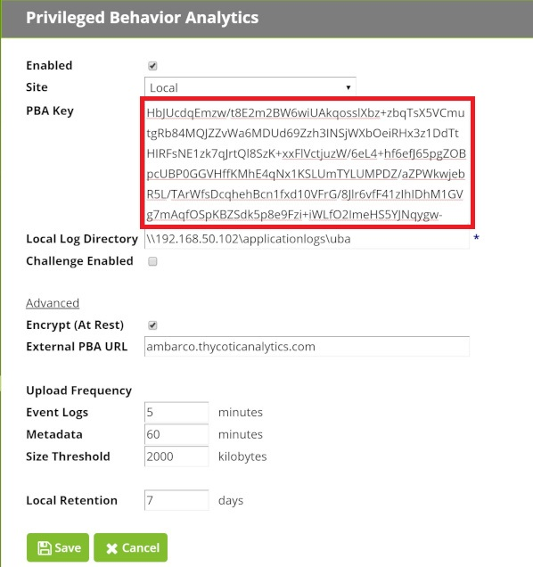

[title]: # (Data Uploader Setup)
[tags]: # (secret server)
[priority]: # (3030)

# Data Uploader Setup Steps

Privileged Behavior Analytics (PBA) processes event data from Secret Server using a data upload. The Data Uploader setup steps depend on your Secret Server version.

Integrating Secret Server and PBA requires an **Integration Key**. This key:  
* contains the secret access key and other parameters for uploading data to Thycotic PBA.
* is encrypted for protection in transit.
* is encrypted and saved when entered into Secret Server using standard Secret Server encryption (AES-256 and DPAPI/HSM if configured).
* can never be loaded again through the UI, but can be updated if the linked PBA account needs to be changed.

## Version 10.3.000015 and Earlier

1. Get the Integration Key from PBA that will be used by Secret Server to authenticate and upload data to PBA.
    * Log in to your PBA instance and navigate to **\<PBA\>/system_settings**.
    * Click on **View Integration Key** and copy the key.
    * If you are prompted whether Secret Server is on version 10.4.000000 or later, click *No*.

        

1. Open Secret Server and navigate to **Administration > Privileged Behavior Analytics**.
1. On the PBA integration page, click **Edit** to bring up PBA configuration.

    

1. Check the **Enabled** box to enable PBA.
1. Choose the **Site** that will process and upload event logs. Selecting local will use your IIS server running Secret Server. 
    * If you are using a **Distributed Engine** you can specify a remote site and upload event data to PBA via Engines. Use this option if you want to offload the work or you prefer that Secret Server's firewall not have a rule allowing outbound connections to the PBA servers. The engine can be configured to allow the connection.
1. Paste the **Integration Key** you copied in step 1 into the **PBA Key** field.

    
1. Set the **Local Log Directory**. Event logs are stored on a local drive or network drive before being uploaded to cloud storage.
    * Secret Server or your Distributed Engines (depending on whether you specify a local or remote site in the previous setting) must have write access to this local directory or network drive location.
    * *IMPORTANT FOR CLUSTERED ENVIRONMENTS:* This setting is the same for all IIS nodes or engines on a given site. Therefore:
    * If you enable background worker on multiple web nodes (see the [Background Worker](bkground-worker-clust-env.md) article) and specify `C:\logs\uba` then you will need to create this same directory on each of your web node servers and ensure each Secret Server installation (web node) can write to its respective local directory.
    * The same applies to a remote site with more than one distributed engine; each of the distributed engine’s host machines must have a directory by this name, or have access to the network share if used.
1. Check **Challenge Enabled** to enable Secret Server Access Challenges. See [Access Challenges](../access-challenges.md) for further information.
1. Check **Encrypt (At Rest)** to encrypt event logs at rest in cloud storage. This is enabled by default and the recommendation is to keep it enabled.
1. Input the **External PBA URL**. This is the URL of your Privileged Behavior Analytics cloud instance. It must be set manually and will change the PBA links in the Tools menu and Setup Home page to direct to your cloud instance in a new tab, instead of directing to this configuration page in Secret Server.
  Setting this to your PBA URL will also convert the **PBA Event Id** column on the **Access Challenges** page to clickable links (see [Access Challenges](../access-challenges.md) for further information).
1. Set **Upload Frequencies**: 
    * **Event Logs**. The frequency that event logs are uploaded to PBA. The recommended interval is 5 minutes. The minimum interval is 2 minutes.
    * **Metadata Logs**: The frequency that metadata is uploaded to PBA. The recommended interval is at least 60 minutes. The minimum interval is 5 minutes. Metadata frequency should vary based on how often new Users and Secrets are added in Secret Server; typically it should not need to be less than 60 minutes.
    * Set the **Size Threshold**: Setting a maximum size threshold will trigger an early upload before the time threshold is met. Because event logs and metadata are compressed prior to upload, the size threshold will not frequently be met, but it safeguards against accumulating too many logs and experiencing processing delays.
1. Set the **Local Retention**. This is the number of days that your event logs and metadata are stored in the local log directory specified. All historic event logs are maintained in the PBA database until account deletion. It is good practice to set this threshold to at least 7 days, because if there is a connectivity issue between Secret Server and PBA, any event logs younger than the **Local Retention** setting will be uploaded upon re-connection.
1. Save the configuration. When the configuration is saved and PBA is set to enabled, the configuration will be validated. It can also be manually validated by clicking **Test PBA Key**.

## Version 10.4.000000 and Later, and Cloud

For Secret Server Installed Version 10.4 and for Secret Server Cloud, event data is uploaded to PBA via queues and micro-loading, and is closer to real-time. Prior versions of Secret Server data upload followed the more typical data warehouse design of file upload and small batch-loading.

### Special Case: PBA Already Enabled

If PBA was already enabled in Secret Server prior to upgrading to version 10.4.000000 or later, you must copy the integration key from PBA to Secret Server in order to enable Single Sign On.

Single Sign On requires a key exchange in order for PBA to use Secret Server as an identity provider, and a new integration key is provided with PBA’s public key in order to initiate this key exchange.

Use these steps to obtain the Integration Key from PBA that will be used by Secret Server to authenticate and upload data to PBA.

1. Log into your PBA instance and navigate to **System Settings** and click **View Integration Key**.
1. Copy the **Secret Server Integration Key**. If you are prompted to specify whether Secret Server is on version 10.4.000000, click *Yes.*

    

1. Open Secret Server and navigate to **Administration > Privileged Behavior Analytics**. On the PBA Configuration page, click **Edit**.

    

1. Check **Enabled** to enable Privileged Behavior Analytics.
1. Choose the **Site** that will process and upload event logs. Selecting local will use your IIS server running Secret Server. 
    * If you are using a **Distributed Engine** you can specify a remote site and upload event data to PBA via Engines. Use this option if you want to offload the work or you prefer that Secret Server's firewall not have a rule allowing outbound connections to the PBA servers. The engine can be configured to allow the connection.
1. Paste the **PBA Integration Key** that you copied in step 2.

    

1. Check **Challenge Enabled** to enable Secret Server Access Challenges. See the [Access Challenges](../access-challenges.md) article for further information. You may also click on **Advanced** to change additional settings.
1. Input the **External PBA URL**. This is the URL of your Privileged Behavior Analytics cloud instance. **It is set automatically by the integration key but may be overridden.** It is used for Single Sign On, redirecting to PBA from the Tools menu, and on the **Access Challenges** page to create links to the PBA events that spawned Access Challenges.
1. Set the **Metadata Interval (Installed Only)**. The frequency that metadata is uploaded to PBA.
    * The recommended interval is at least 60 minutes.
    * The minimum interval is 5 minutes.
    * Metadata frequency should vary based on how often new Users and Secrets are added in Secret Server; typically it should not need to be less than 60 minutes.
    * For Cloud, this setting is unavailable and defaults to 60 minutes.
1. When the configuration is saved and PBA is set to enabled, the configuration will be validated. It can also be manually validated by clicking **Test PBA Key**.
