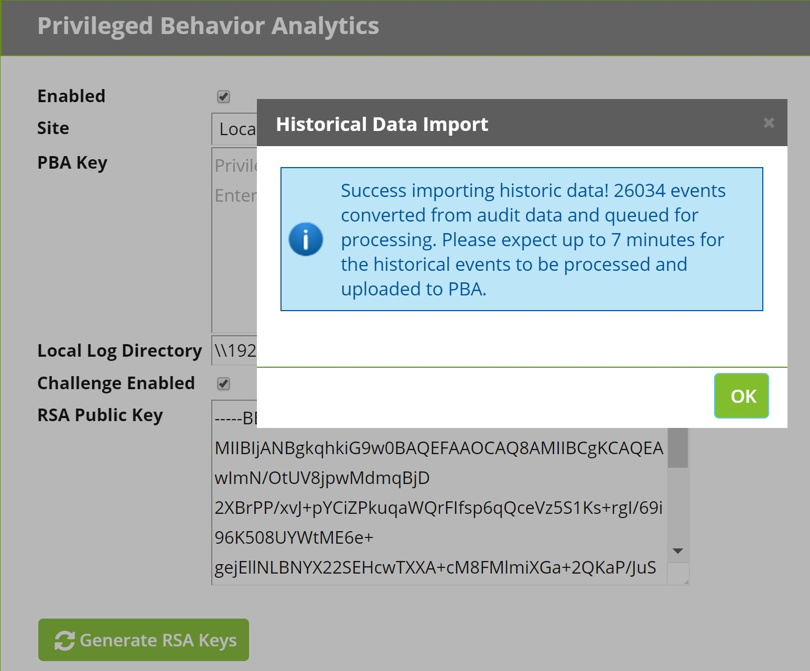

[title]: # (Historical Data Import)
[tags]: # (Privileged Behavior Analytics,PBA,Historical Data Import)
[priority]: # (3050)

# Historical Data Import

When you first enable Privileged Behavior Analytics, you will be prompted whether to import the last 30 days of event data.

* Importing historical data reduces the learning period and potentially enables you to begin analyzing user behavior from day one, assuming Secret Server has been installed long enough to meet the learning period requirement.
* Event data is not persisted in Secret Server, but audit data is persisted. Accordingly, PBA derives events from audit data.
* By default, only 30 days of historical event data is imported because this is typically the most relevant data for learning about user behavior.
* If you seek to import more than 30 days of historical data, please contact [Thycotic Support](../../support/index.md) for assistance.

When you receive the prompt about whether to import historical data, select:

* **OK** to import 30 days of historical data
* **Don’t Ask Again** to permanently dismiss the query
* **Remind Me Later** to receive the prompt again the next time you save a PBA configuration with PBA enabled.
  * If you select **Remind Me Later** and come back on a later date to import historical data, the original 30-day time range will be used for the import, that is, the 30 days immediately prior to the first date that you enabled PBA. This ensures data continuity.

If you click **OK** to begin the import, you will see a dialog like the one below, stating the number of events to be imported and a time estimate for the import to complete. Immediately queued for processing, all the events must pass through the data pipeline for upload to Privileged Behavior Analytics.

* For Secret Server v10.3.000015 and earlier, note that the **Event Log Upload Frequency** may affect the total processing time. A shorter interval will decrease the time and a longer interval will increase the time.

