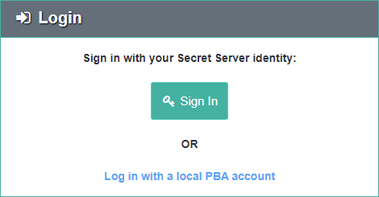

[title]: # (Single Sign-On)
[tags]: # (secret server,sso)
[priority]: # (3080)

# Single Sign-On (Version 10.4 and Later, Cloud)

As of version 10.4.000000, Secret Server can act as an identity provider for PBA.

* Any user with the *View Security Analytics* role permission in Secret Server may log into PBA.
* Additionally, any user with *Administer Security Analytics* role permission is able to perform administrative actions once logged into PBA through Single Sign-On (SSO).
* Local PBA users (the initial users prior to integrating PBA into Secret Server) still have administrative rights as well.

Typically, Single Sign On will start working without additional configuration.

## Verify Single Sign On

Verify that on *both* of these pages—**\<SECRET SERVER\>/AdminAnalyticsView.aspx** and **\<PBA\>/system_settings**—the PBA and Secret Server key pairs *both* show a status of **Confirmed**. This key exchange is used for verification of Secret Server as an identity provider.

In order to verify that the SSO claim was signed by Secret Server, PBA must have a copy of Secret Server’s public key. Secret Server versions 10.4.000000 or later have infrastructure for key exchange and rotation between Secret Server and PBA.

* When the integration key is first copied from PBA and saved to Secret Server, it contains PBA’s initial public key.
* Secret Server then generates its own key pair and sends its public key to PBA.
* PBA registers Secret Server’s public key and sends confirmation back to Secret Server.

When a key rotation is initiated, PBA generates a new key pair and sends a signed request to Secret Server. The rest of the process is the same as the initial key exchange, except that each message is signed and verified during the rotation.

## Troubleshooting

If Secret Server or PBA shows that its Key Pair status is **Pending Confirmation**, try the **Resend Confirmation** button in either application.

* For example, if in Secret Server its key pair is **Pending**, then you would click the **Resend Confirmation** button in PBA, so that PBA will retry communicating to Secret Server that PBA did register Secret Server’s latest public key.
