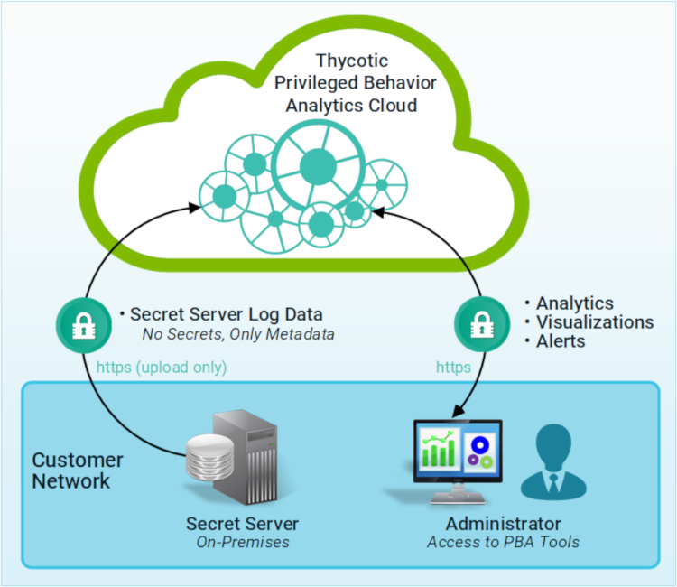

[title]: # (Architecture)
[tags]: # (Privileged Behavior Analytics,PBA,Overview,Architecture,Metadata)
[priority]: # (2010)

# Architecture

Privileged Behavior Analytics uses the Amazon AWS Cloud and advanced algorithms to provide its features.

  

As in the illustration:

* Your Secret Server uploads activity logs to PBA in the Cloud (AWS).
* PBA applies advanced algorithms to the data to deliver alerts, analytics, and visualizations.
* To access these, your administrative staff use a browser to authenticate with PBA.
