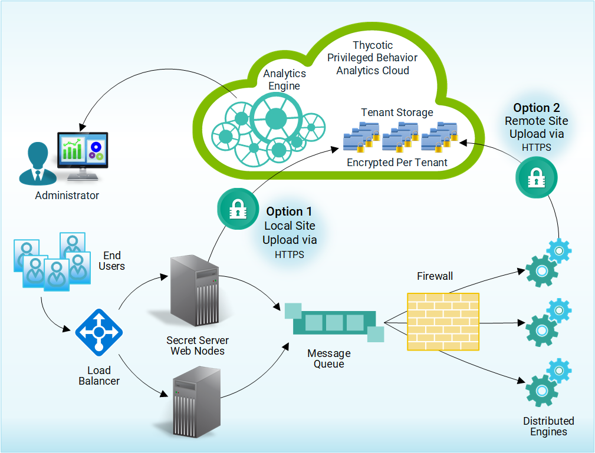

[title]: # (Data Security)
[tags]: # (secret server,overview,metadata)
[priority]: # (2020)

# Secret Server Metadata and PBA Data Security

Thycotic Secret Server secures access to your company’s most important resources. Privileged Behavior Analytics further secures those resources by generating insights about how your privileged users access the most protected resources. Given training against a suitable data set, PBA will alert you when a privileged user is behaving atypically, which could signal an intruder or an inside malefactor.

PBA also secures those resources by adhering to stringent standards for data security.

## PBA Resides in the Cloud

As a Cloud service, Privileged Behavior Analytics is easily accessed and highly secure.

## Secret Server Uploads Only Metadata

Once configured to work with PBA, your Secret Server securely uploads data to your organization’s tenancy with the PBA service. PBA uses the event log data generated by Secret Server, so that only **metadata**—data about your data, not your data itself—go to the Cloud for analysis by PBA.

This means that no actual Secret fields, such as passwords, private keys, notes, or other first-order data ever leaves your Secret Server. Instead, only data **about** these things—literal **metadata**—upload to PBA.

* For example, for a Secret that is a Windows account, fields uploaded for analysis by PBA in the Cloud would include the Secret Name, Secret Template, Secret Folder, Secret Policy ID, and Permissions.
  * These are fields about the Secret, but not about the Windows account it contains.
* Fields like Machine, Username, Password, Notes, Site, or any attached files, extra fields, or Secret keys do not upload, as these comprise the actual content of the Secret.

## PBA Users Log In to the PBA Cloud Service

Your organization’s designated users securely log in to the PBA service to use its analytics tools and configure alerts.
PBA continuously processes the log data and applies analytics to deliver insights and alert on anomalous behavior.

## Data Protections and Security Applied Throughout

The design and build of Privileged Behavior Analytics maintains at all times the security of your Secret Server.

### Security Provisions Apply to Data Uploads

Significant protection applies to data uploads by Secret Server to Privileged Behavior Analytics.

* Data sent to the cloud is via a one-way upload that can only be initiated by Secret Server.
* The data upload mechanism provides no means for remote access into your Secret Server.
* In addition, the data uploads to a Cloud location to which only your organization’s Secret Server can write.
* PBA encrypts your organization’s uploaded data with a key unique to your PBA tenancy.

### Alternative Data Upload via Distributed Engine Architecture

If your organization disallows outbound connections from Secret Server’s network segment, you can instead upload using Thycotic’s Distributed Engine architecture.

* Option 1 in the illustration shows the default manner of upload by the Secret Server web node in the local site.
* Option 2 shows a remote site upload using a Distributed Engine.

### Security Provisions Apply to Connections to the Cloud

To secure your data end-to-end, all connections to PBA are encrypted with industry-standard Transport Layer Security (TLS) encryption. This includes all data uploads to the Cloud and all use of PBA.

### Built on Amazon Web Services

PBA relies on the best-in-class security provided by Amazon Web Services. You can find out more about the underlying security of AWS at:

* https://aws.amazon.com/security/

### Strict Access Control and Tenant Isolation

PBA features tenant isolation and exacting internal access controls that provide multiple safeguards against unauthorized access to any organization’s data.

* PBA isolates each organization’s data from that of other organizations.
* Strong access controls give each PBA operational component only the rights required to perform its role.

These layers of defense ensure that even were unauthorized parties to gain access to a part of the PBA Cloud, their access would be isolated to that tenant and to the abilities of the compromised component.

### Proactive Monitoring

Thycotic continuously applies proactive monitoring protocols to the PBA service.

* Administrators will receive alerts on any indication that someone *might* be trying to gain unauthorized access.
* Atypical behavior patterns among Thycotic’s own administrative staff would likewise be flagged for review to guard against the emergence of inside malefactors.

### Encryption at Rest

PBA encrypts data at rest in the cloud. This additional layer of protection safeguards information in PBA even should an unimaginable series of events somehow leave such data exposed.
