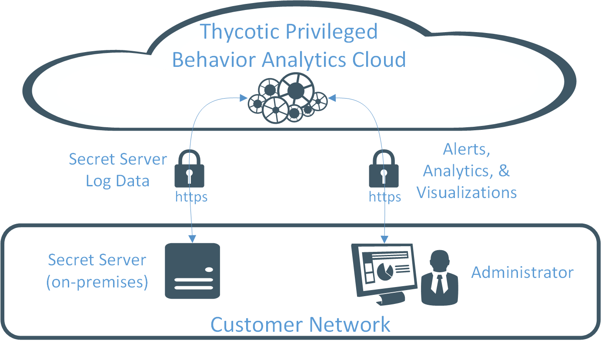
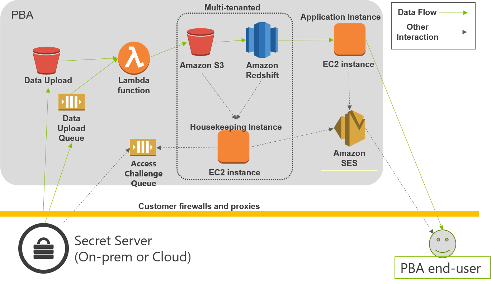

[title]: # (Overview)
[tags]: # (Privileged Behavior Analytics,PBA,)
[priority]: # (2000)

# Overview
Privileged Behavior Analytics works with your Secret Server to improve the security of your enterprise systems by helping to **visualize**, **detect**, **interrupt**, and **announce** threatening activity and behavior across your IT infrastructure.
* **visualize**: PBA applies tools to Secret Server log files, visualizing complex data relationships to help your staff recognize and respond to security threats
* **detect**: PBA learns patterns of activity�behaviors�associated with security threats and continuously monitors for such threat indicators
* **interrupt**: PBA automatically interrupts concerning behaviors, such as by mounting **Access Challenges** of several types
* **announce**: PBS uses multiple channels to notify appropriate staff as it detects possible threats
## Privileged Behavior Analytics in One Sentence
Secret Server uploads its logs data to the PBA Cloud service, where your users log in to use analytics tools and configure alerts; strong protections apply to data throughout all activities.

## Architecture
The Privileged Behavior Analytics system draws on internal AWS services to provide its features and functionality. The following diagram illustrates the flow of data through AWS services.

## Secret Server Data and Privileged Behavior Analytics
Thycotic Secret Server secures access to the most important resources in your company. Privileged Behavior Analytics further secures those resources by generating insights about how your privileged users access the most protected resources. Given training against a suitable data set, PBA will alert you when a privileged user is behaving atypically�which could signal an intruder, or an inside malefactor.
### PBA Resides in the Cloud
As a Cloud service, Privileged Behavior Analytics is easily accessed and highly secure.
### Secret Server Uploads Metadata
Once configured to work with PBA, your Secret Server securely uploads data to your organization�s tenancy with the PBA service. PBA uses the event log data generated by Secret Server, so that only **metadata**�data about your data, not your data itself�goes to the Cloud for analysis by PBA.
This means that no actual Secret fields, such as password, private keys, notes, and other first-order data, ever leaves your Secret Server related to PBA. Instead, only data **about** these things�literal **metadata**�uploads to PBA.
* For example, for a Secret that is a Windows account, fields uploaded for analysis by PBA in the Cloud would include the Secret Name, Secret Template, Secret Folder, Secret Policy ID, and Permissions; these are fields about the Secret, but not about the Windows account it contains.
* Fields like Machine, Username, Password, Notes, Site, or any attached files, extra fields, or secret keys, do not upload, as these comprise the actual content of the secret.
### PBA Users Log In to the PBA Cloud Service 
Your organization�s designated users securely log in to the PBA service to use its analytics tools and configure alerts.
PBA continuously processes the log data and applies analytics to deliver insights and alert on anomalous behavior.
## Data Protections and Security Applied Throughout
The design and build of Privileged Behavior Analytics aims not to reduce the security of your Secret Server.
### Security Provisions Apply to Data Uploads
Significant protection applies to data uploads by Secret Server to Privileged Behavior Analytics.
* Data sent to the cloud is via a one-way upload that can only be initiated by Secret Server.
* The data upload mechanism provides no means for remote access into your Secret Server.
* In addition, the data uploads to a Cloud location to which only your organization�s Secret Server can write.
* Your organization�s uploaded data is encrypted with a key unique to your organization�s PBA tenancy.
* If your organization does not allow outbound connections from the network segment where Secret Server resides, PBA supports upload via Thycotic�s Distributed Engine architecture.
    * Option 1 in illustration shows the default manner of upload via the     Secret Server web node in the local site.
    * Option 2 shows a remote site upload via a Distributed Engine.
images/083.gif
### Security Provisions Apply to Connections to the Cloud
To secure your data end-to-end, all connections to Privileged Behavior Analytics are encrypted with industry standard Transport Layer Security (TLS) encryption. This includes all data uploads to the cloud and all usage of the Privileged Behavior Analytics application.
### Built on Amazon Web Services
Privileged Behavior Analytics relies on the industry leading security provided by Amazon Web Services (AWS). You can find out more about the underlying security of AWS at:
>   https://aws.amazon.com/security/
### Strict Access Control and Tenant Isolation
The Privileged Behavior Analytics service features tenant isolation and strict internal access controls that provide multiple safeguards against unauthorized access to any organization�s data.
PBA isolates each organization�s data from that of other organizations. Strict access controls give each Cloud operational component only the rights required to perform its role. These layers of defense ensure that even if a party gained unauthorized access to one part of the cloud, they would be isolated to that tenant and component.
### Proactive Monitoring
Proactive monitoring protocols apply continuously to the Privileged Behavior Analytics cloud system. Administrators will receive alerts on any indication that someone *might* be trying to gain unauthorized access. Atypical behavior patterns among Thycotic�s own administrative staff would likewise be flagged for review to guard against emergence of inside malefactors.
### Encryption at Rest
Privileged Behavior Analytics encrypts data at rest in the cloud. This additional layer of protection safeguards information in PBA even should an unimaginable series of events somehow leave such data exposed.
## Use Case Videos
These videos depict the three primary use cases for Privileged Behavior Analytics.
### Alert Use Case
*(embedded video: pending team approach to inserting HTML for vimeo video player within Markdown files)*
### Access Use Case
*(embedded video: pending team approach to inserting HTML for vimeo video player within Markdown files)*
### Temporal Use Case
*(embedded video: pending team approach to inserting HTML for vimeo video player within Markdown files)*
