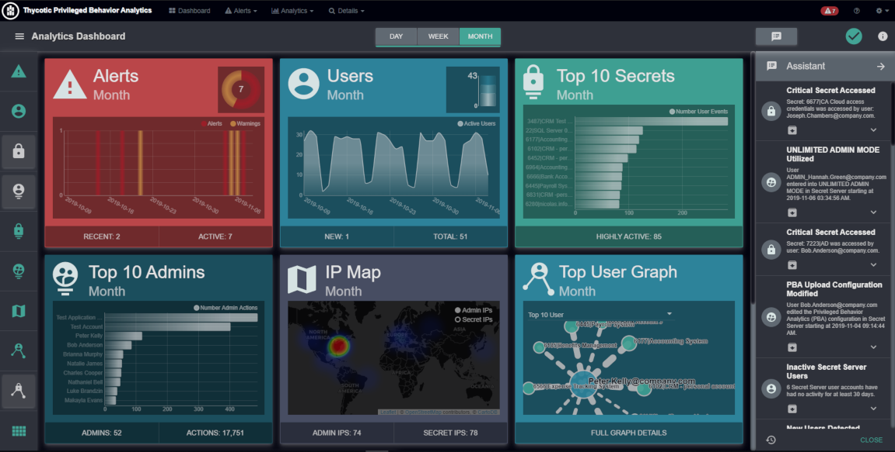

[title]: # (Analytics Dashboard)
[tags]: # (Secret Server,Privileged Behavior Analytics,PBA,Operations,Analytics,Dashboard)
[priority]: # (4010)

# Dashboard

PBA’s **Analytics Dashboard** landing page collects commonly used tools and views so you can easily recognize anything that would be out of the ordinary for your Secret Server environment.

* Multiple widgets present at-a-glance data visuals that cycle through views of activity for the last day, week, and month.
* The widgets activate or deactivate when you click the controls for each on the left side of the Dashboard.
* Cycling pauses on the data view for the last day, week, and month when you click on the Day, Week, and Month controls.
* Additional settings (dashboard theme, widget settings, cycle duration) are accessible through the three horizontal bars icon on the top left side.

On the top right of the Dashboard you may click **Assistant** to activate the **Dashboard Assistant**.

* The Dashboard Assistant focuses you on recent events and allows you direct access to event records by clicking the title.
* The downward facing arrow icons on each event act to expand the record area to show you more information.
  * The extra information includes  guidance on why the event has significance and what steps you should consider.
* Clicking the clockface icon at the bottom left of the Assistant application panel will  open the **Assistant Archive** page and show past events.
