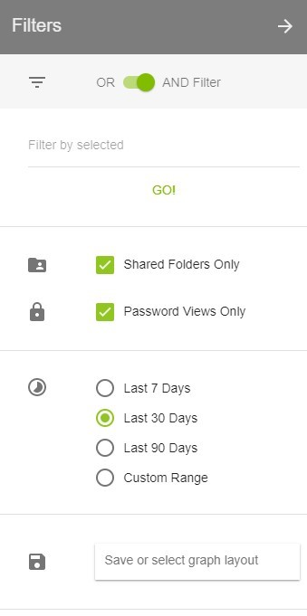
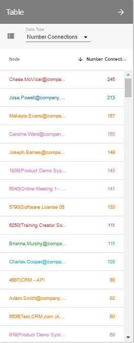
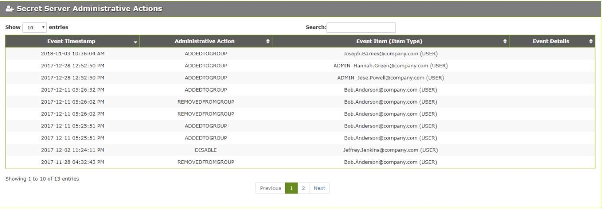

[title]: # (PBA Operations)
[tags]: # (Privileged Behavior Analytics,PBA,)
[priority]: # (4000)

# PBA Operations
Once you have setup Secret Server and PBA to work together, as in the last sections, you will begin normal operations.
## Dashboard
The Dashboard is the first page you will be directed to upon logging into Privileged Behavior Analytics. The page will contain multiple widgets that contain at-a-glance data on what is happening in your Secret Server environment. The page automatically cycles through views of your widgets from the last day, week, and month. You may pause the cycling by simply clicking on “Day”, “Week,” or “Month.” The widgets can be activated or deactivated by clicking on their corresponding symbols on the left side of the page.

On the top right of the Dashboard you may click () to activate the Dashboard Assistant. The Dashboard Assistant gives guidance to users on where they should focus their attention. It shows recent events and allows the user to go to those events in Privileged Behavior Analytics by clicking the event title. In addition, users may click the downward facing arrow icons on each event to receive more information about why the event matters and what they may do about it. Finally, users may archive events by clicking ().
## Secret Access Graph
The Dashboard is the first page you will be directed to upon logging into Privileged Behavior Analytics. The page will contain multiple widgets that contain at-a-glance data on what is happening in your Secret Server environment. The page automatically cycles through views of your widgets from the last day, week, and month. You may pause the cycling by simply clicking on “Day”, “Week,” or “Month.” The widgets can be activated or deactivated by clicking on their corresponding symbols on the left side of the page.

On the top right of the Dashboard you may click () to activate the Dashboard Assistant. The Dashboard Assistant gives guidance to users on where they should focus their attention. It shows recent events and allows the user to go to those events in Privileged Behavior Analytics by clicking the event title. In addition, users may click the downward facing arrow icons on each event to receive more information about why the event matters and what they may do about it. Finally, users may archive events by clicking ()
When you expand (double-click) a Community, you can see all the Users and Secrets it contains. The size of each node indicates how many accesses it has and the thickness of links follows the same principal. Community, User, and Secret nodes may be outlined by a shade of red. If this is the case, there is an active alert for a User and/or Secret and more information can be found by right clicking on the affected nodes and observing active alerts or by navigating to the Alerts \| Privileged Behavior Alerts page.

Whether a Community is expanded or not, you can right click on any node or link on the Secret Access Graph to add notes or see further details.
### Tools 
The Tools menu (cogwheel button) allows you to customize what is displayed on the graph:
>   Search - At the top of the menu is a search field where you can enter the name of a User or Secret to highlight that specific node on the Secret Access Graph. Press Enter to repeat the animation.
>   Background Blobs – Turned on by default, these surround all nodes in an expanded Community with a color similar to that of the collapsed Community.
>   Node Labels – Turned on by default, these are Community numbers, Secret names, and User names shown next to each node.
>   Note Boxes – Turned on by default, these represent notes that have been placed on any nodes or links.
>   Cluster/Expand by – By default, all nodes will be clustered by Communities. You can select the dropdown here to choose to cluster nodes by Secrets and Users if desired.
>   Node Color – There are multiple options for choosing how the nodes within an expanded Community are colored:
>   Community – All Secret and User nodes will be the color of the Community when it is collapsed.
>   Secret/User – User nodes are colored blue and Secret nodes are colored green (default coloring).
>   Number Connections –Secret and User node colors will range from white to red. The redder a node is, the more active it is.
>   Number Unique – Secret and User nodes will range from white to red. The redder a node is, the more unique accesses it has. Secret nodes will always be white.
>   Social Network Metrics – These options can reveal important Secrets or Users in the network.
### Filters 
The Filters menu (three horizontal lines button) provides options to limit the number of nodes and links displayed.

>   OR AND Filter – Determines how filters will be applied to the Secret Access Graph.
>   Filter by selected – Lets you filter the Secret
>   Access Graph display by Secret, User, Group,
>   Folder, IP Address, Secret Importance, and Template.
>   Shared Folders Only – Unchecking this box will add Secret access activity from Users’ Personal Folders in Secret Server.
>   Password Views Only – Turned on by default, this shows only Secret accesses, which include: web launches, passwords displayed, passwords copied to clipboard, Secrets edited, and Secrets exported. If turned off, all other Secret activity will be shown.
>   Time Ranges – By default, the Secret Access Graph will show activity from the last 30 days. The Custom Range option allows selecting a start and end date to refine activity displayed.
>   Save or select graph layout – You may choose to save filtered views of the Secret Access Graph to quickly recall important access landscapes.
### Notes 
The Notes menu can be accessed by clicking the green button depicting a note with a folded corner at the top right of the Secret Access Graph page.
All notes on nodes and links are listed here. You can edit any note by clicking on it or delete a note by clicking on the trashcan icon to the right of the note.
Notes can be created by right-clicking on a node (circle) or link (line) in the Secret Access Graph. A small square of the color selected will appear on the node or link after the note is created. Hovering over the square or a note in the Notes menu will briefly highlight the note square on the Graph.

### Table 
The Table menu can be accessed by clicking the green button between the Notes and Tools buttons at the top right of the Secret Access Graph page. This menu gives you a full, sortable text-based list of all User and Secret node metrics. Placing your mouse over any of the node names in the lists will highlight that node on the Secret Access Graph if the Community it is in is expanded.
>   Community – Lists User and Secrets nodes and the Community number they are in.
>   Secret/User – Lists User and Secrets node names and whether each is a User or Secret.
>   Number Connections – Lists User and Secret nodes and how many accesses they have had or performed on other nodes.
>   Number Unique – Lists User and Secret nodes and how many unique Secrets or Users, respectively, they are connected to.
>   Last Active – Lists User and Secret nodes and the timestamp of the last activity each had.
>   First Active – Lists User and Secret nodes and the timestamp of the first activity each had recorded in Privileged Behavior Analytics.
>   Social Network Metrics – Lists User and Secret nodes and the numerical value of the selected metric.

## Privileged Behavior Alerts
 The Privileged Behavior Alerts page allows you to see any events that have occurred in Secret Server that were outside normal observed behavior. In addition, you can receive alerts under customizable circumstances whenever these abnormal events occur (see *System Settings* page).
You can navigate to Privileged Behavior Alerts by going to Alerts \| Privileged Behavior Alerts.

At the top of the page you can use the search field to search for specific alerts by using text from any of the rows in the table. The table organizes the alerts by these column values:
>   Severity – Whether the event was categorized as an alert (serious event) or if it was categorized as a warning (minor event).
>   Score – The numerical score given to the event depending on how severe the events incorporated into the alert were.
>   User – The Secret Server User who caused the alert. Clicking on their name brings you to a *User Details* page where you can investigate their activity further.
>   Range of Activity – The timeframe the alert occurred within.
>   Secret Accesses – Any Secrets that were accessed during the timeframe of the alert that contributed to the alert. Clicking on any of the Secrets will bring you to a *Secret Details* page where you can investigate the Secret’s activity further.
>   Admin Actions – Any administrative actions taken in Secret Server during the timeframe of the alert that contributed to the alert. Clicking on the Admin Actions listed will take you to the table of all administrative activity for that User.
>   Temporal Behavior – A time entry will be listed here if the alert occurred at a time the User does not normally access the Secrets involved in the alert. Clicking on the time entry will bring you to that User’s Temporal data.
>   State – Whether the alert is active or inactive. The Clear button will remove the alert and send it to the Historical Behavior Alerts page. You can also click Actions if you wish to further investigate the alert, log actions you may have taken on the alert, adjust the importance of any Secrets involved in the alert, or provide feedback to Thycotic on the usefulness of the alert.

### Historical Behavior Alerts 
The Historical Behavior Alerts page is where all alerts are archived after they have been cleared from an active state. You can reach the Historical Behavior Alerts by navigating to Alerts \| Historical Behavior Alerts.

State Changed by – The User who cleared the alert in Privileged Behavior Analytics.
Notes – Any notes left on the alert before it was cleared.
## User Watch List
 The User Watch List page provides a convenient location to track users of interest and easily access information about each. By default, the Privileged Behavior Analytics (PBA) System adds to the Watch List users with active alerts and warnings and new users. Upon clearing alerts and warnings or when a new user has been active for 30 days, the System removes them from the Watch List. These automated actions can be disabled from the *System Settings page*.
On the right side of each user’s Watch List entry are buttons to edit (reasons and notes) or delete the entry. For Secret Server customers that have a Secret Server Custom URL, an additional lock icon will appear, which links to the user’s Edit page in Secret Server. To add a Secret Server URL for direct linking: in Secret Server hover over the Admin button in the toolbar, select Configuration, Edit, then set the "Secret Server Custom URL." The URL will be passed to Privileged Behavior Analytics in the next metadata upload.

Users can be added to the Watch List by clicking the Add User icon at the top right of the page. Multiple new or existing users can be added to the list along with a list of reasons and notes. For existing Watch List users, the reasons and notes will be appended to their current reasons list and notes.

>   To make changes to a reason, click the Edit Reasons button on the top right side of the toolbar. The current list of reasons will appear with options to change the name or color or to delete the reason from the Watch List. These changes affect all watch listed users with the edited reason and are not tracked in the Last Updated information.
## Secret Access Clock
 In Privileged Behavior Analytics, the Secret Access Clock gives you a simple overview of all the time-related, or temporal, activity that has occurred in Secret Server.
You can access the Secret Access Clock by navigating to Analytics \| Secret Access Clock.

The coloring of the graphs range from white to dark blue. White is an indication of no activity and dark blue indicates a lot of activity. The center of the circular chart will display the date range and number of events for the selected timeframe.
You can further refine what temporal data is displayed by searching for a Secret or User. This will refresh the graphs to only reflect that choice. If you refine by a Secret and wish to see which Users accessed that Secret for a particular day or time you can right-click on the corresponding bar in any of the graphs and then click on the name of the Secret. If you refine by a User and wish to see which Secrets they accessed for a particular day or time you can right-click on the corresponding bar and click on the name of the User.
In addition, you can use the left and right arrows at the base of the circular chart to move back or forward through specific weeks. If you wish to hide the side and bottom bar charts from the display, you can click the gray chart button to the top right of the circular chart.
## Most Active Secrets
 In Privileged Behavior Analytics, the Most Active Secrets page gives you a ranked overview of the top 50 most accessed Secrets in your Secret Server environment.
You can see your Most Active Secrets by navigating to Analytics \| Most Active Secrets.

The list contains the Secret ID, Secret name, and number of times it has been accessed paired with a bar chart. By default, you will see the top 50 Secrets in your Secret Server environment for the past month. You can further filter the list by a User or specific timeframe. Clicking on a Secret in the list will take you to its *Secret Details* page.
## Most Active Users
In Privileged Behavior Analytics, the Most Active Users page gives you a ranked overview of the top 50 most active Users in your Secret Server environment.
You can see your Most Active Users by navigating to Analytics \| Most Active Users.

The list contains the User name, Display name, and number of Secret accesses paired with a bar chart. By default, you will see the top 50 Users in your Secret Server environment for the past month. You can further filter the list by a Secret or specific timeframe. Clicking on a User in the list will take you to the *User Details* page for that User.
## Secret Details
The Secret Details page can be used to investigate how a Secret is being accessed from the perspective of many types of data collected on it.
You can access Secret Details by navigating to Details \| Secrets.

The Secret Details page will list all Secrets with Secret ID, Secret Template, the number of unique Users that access them, the total number of accesses by Users, when it was created, and when it was last active.
If you click on any of the Secret names you will be directed to that Secret’s Details page, which shows the following:

>   User Activity – Lists the most recent 500 encrypted accesses for the Secret, when they occurred, who accessed it, and how it was accessed.

>   Most Frequent Users – An animated representation of the top 20 users accessing the Secret the most. You can zoom into the graph by scrolling or right-click on any node or link to view more details.

>   Temporal Behavior - A chart showing all temporal data for the Secret organized by time of day and day of the week. The numbers across the bottom indicate the total events involving that Secret for that time of day. The values across the right side indicate the number of events involving that Secret for that day of the week. The legend at the bottom shows the number of events that correlate to the coloring of the chart blocks. Mouse over a block to get the total number of accesses for that day of week and hour of day.
>   Secret Name and Folder History – Lists any changes that have been made to the name of the Secret or the folder it is kept in inside Secret Server.
## User Details
In Privileged Behavior Analytics, the User Details page is the ideal place to dive deeper into a specific User’s behavior from the perspective of many types of data collected on them.
You can access User Details by navigating to Details \| Users.

The User Details page lists all Users, their Display names, account type, the number of unique Secrets they have accessed, the total number of times they have accessed Secrets, when they were first seen in Privileged Behavior Analytics, and when they were last active.
If you click on any of the User names you will be directed to that User’s Details page, which shows the following:

>   User IP Address History – Lists any IP addresses they have accessed Secret Server from.

>   Secret Activity –Lists the most recent 500 encrypted Secret accesses, when they occurred, the Secret IDs and names accessed, and how they were accessed.

>   Secret Server Administrative Actions – Lists any administrative actions the User has performed in Secret Server, when it occurred, what the specific actions was, and if it affected any Secret Server Users.

>   Activity Timeline – Chart showing when a User has performed Secret accesses, Secret modifications, administrative actions in Secret Server, or has logged in or out of Secret Server over time. Each activity is denoted by a symbol shown in the legend at the top, and placing your mouse over any of the symbols in the graph will give more details on what they did at that time. Grabbing and moving the side buttons on the bottom chart will zoom the top chart.

>   Most Frequent Secrets – An animated representation of the top 20 most accessed Secrets by the User. You can zoom into the graph by scrolling or right-click on any node or link to view more details.

>   Temporal Behavior – A chart showing all temporal data for the User organized by time of day and day of the week. The numbers across the bottom indicate the total events involving the User for that time of day. The values across the right side indicate the number of events involving the User for that day of the week. The legend at the bottom shows the number of events that correlate to the coloring of the chart blocks. Mouse over a block to get the total number of accesses for that day of week and hour of day.
