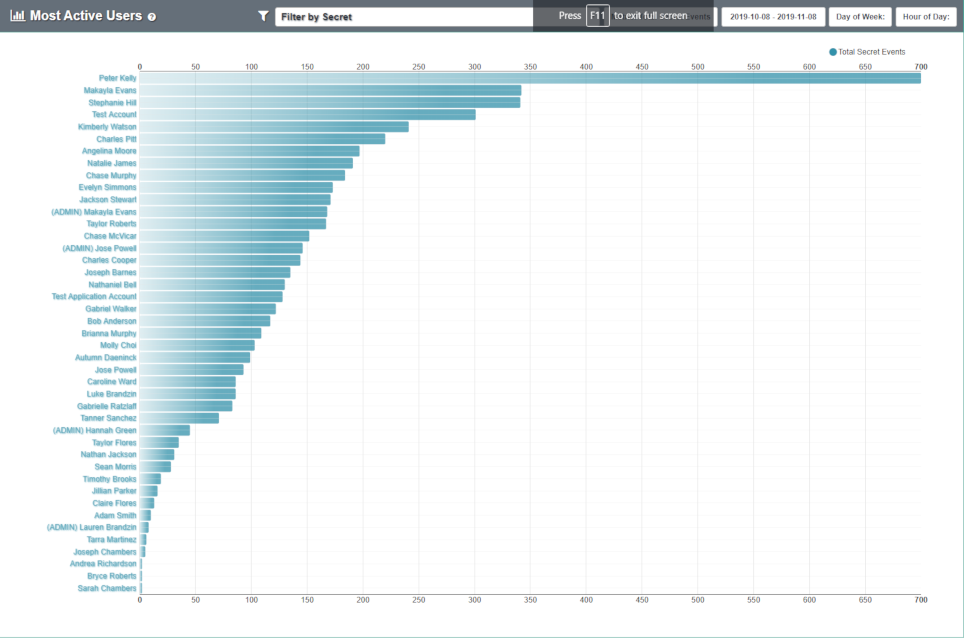

[title]: # (Most Active Users)
[tags]: # (Privileged Behavior Analytics,PBA,Operations,Most Active,Rank,50 Users)
[priority]: # (4080)

# Most Active Users

Most Active Users ranks the top 50 most active Users in your Secret Server environment. You can see your top 50 most active users by navigating to **Analytics** > **Most Active Users**.

The list contains the User Name, Display Name, and number of Accesses to Secrets, with a bar chart as visual reference.

* By default, you will see the top 50 Users in your Secret Server environment for the past month.
* You can further filter the list by a Secret or specific timeframe.
* Clicking on a User in the list will take you to the **User Details** page for that User.
