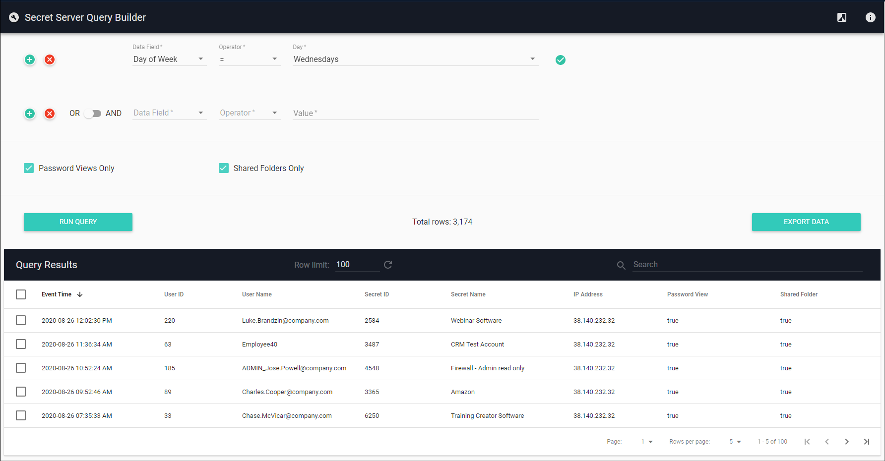

[title]: # (Query Builder)
[tags]: # (Secret Server,Privileged Behavior Analytics,PBA,Operations,Query,Builder)
[priority]: # (4140)

# Query Builder

The **Query Builder** page allows you to retrieve data that meet criteria you specify. A table shows results of the query, and data can be exported for offline analysis or auditing.

Click the Toggle Theme button to change between light and dark themes.

On each query line, click the Add Line button to insert a line below the current line. Click the Remove Line button to delete the current line.

Select "OR" or "AND" using the switch to apply that condition to the line above plus the current line. The "AND" lines will be grouped together as if they were enclosed in parentheses with "OR" applied between each group.

All three options: "Data Field", "Operator", and "Value" (or Temporal selection) must be set for the line to be included in the query. A checkmark will appear on the right side when all selections are valid.

The "Value" search input accepts "\*" (wildcard) and uppercase "AND", "NOT", and "OR" searches (but no mixing AND, NOT, OR, nor parentheses). Some data field types show their values with a prefix (e.g. "IP: 127.0.0.1"). When using the "contains" and "not contains" operators, wildcards ("\*") are allowed in the search term.

For "Event Time" entries, most time formats are accepted. For "Temporal" data types the application assumes timestamps are in the Local Timezone set in System Settings.

Press the "Run Query" button to display a table of results. Rows can be selected for export ("Export Data" button). The "Row Limit" input allows changing the maximum number of rows stored in the table. The "Search" box filters any matching table rows.

Data returned are the most recent events based on the latest update and could be delayed several minutes from the current time.

>**Note**: IP address locations are prone to change and can be inaccurate and imprecise, sometimes located to only the region or country level. This app shows only the most recent available IP address location information, which might have been updated since the time an IP address was last accessed. Location data are derived from MaxMind's GeoLite2.
