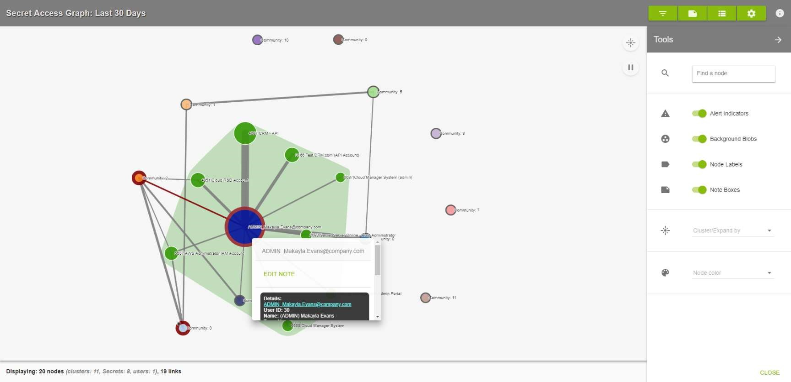
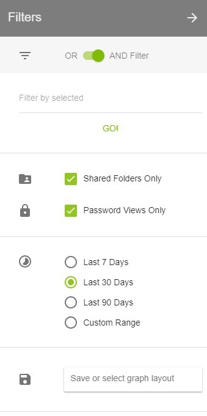
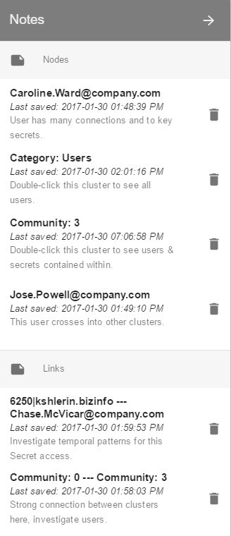
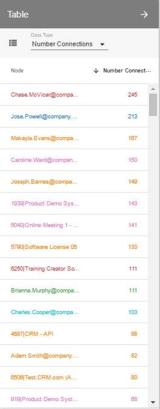

[title]: # (Secret Access Graph)
[tags]: # (Privileged Behavior Analytics,PBA,Operations,Secret Access Graph)
[priority]: # (4020)

# Secret Access Graph

The Secret Access Graph applies advanced algorithms to your Secret Server environment's activity logs to identify **Communities**.

* A Community is a collection of Users who have significant similarities when compared on metrics such as which secrets they access, when they access the secrets, and how many times.

As an example, consider Users of a corporate network who report to work on the same weekday daytime 8-hour shift, all using on-premises desktop computers with Ethernet connections to the corporate network. These users will strongly overlap in their pattern of secrets access:

* they log in and access Secrets in a burst once each weekday morning
* their workstations remain persistently connected, so they need not reauthenticate often during the workday
* sometimes they log in and access Secrets in the late weekday evenings, from their home devices, on days when they take work home
* not so much on Saturdays
* but quite frequently the last hours of Sunday nights, as they see what they're looking at Monday morning

Now consider a different group of Users who are mobile sales staff. These Users also strongly resemble each other in their patterns of secrets access:

* they connect anew to the corporate network by VPN many times each day, each time from an untrusted network
* they must re-access their Secrets every time they connect
* they tend to use the Secrets for brief, dispersed periods of time across a much longer work day, beginning earlier and running later, because sales work often requires those hours
* weekends see a desert of activity by this group, because most sales prospects are only reachable at their work locations, and generally do not want to be reached at home

These two User populations would show up in PBA as distinct Communities. In the PBA Secret Access Graph, they would be represented as globes at the nodes of a network of such globes, each representing a collection of Users having some degree of similarity in the patterns of their access of Secrets.

A larger globe represents a larger number of accesses, by dint of either more Users or more Secrets. The distances between globes corresponds to the degrees of similarity among them, with globes closer together being more similar. The links connecting the Communities also vary in their qualities, denoting more or less overlap in Users or Secrets accessed between two Communities.

Color also encodes information; a red shade around a node or link means there is an active Alert for a User or Secret in the node. Right-clicking the affected nodes will access active Alerts.

Whether a Community is expanded or not, you can right click on any node or link on the Secret Access Graph to add notes or see further details.

## Tools

The Tools menu (cogwheel button) allows you to customize what is displayed on the graph:

* **Search**: At the top of the menu is a search field where you can enter the name of a User or Secret to highlight that specific node on the Secret Access Graph. Press Enter to repeat the animation.
* **Background Blobs**: turned on by default, these surround all nodes in an expanded Community with a color similar to that of the collapsed Community
* **Node Labels**: turned on by default, these are Community numbers, Secret names, and User names shown next to each node
* **Note Boxes**: turned on by default, these represent notes that have been placed on any nodes or links
* **Cluster/Expand by**: by default, all nodes will be clustered by Communities; you can select the dropdown here to choose to cluster nodes by Secrets and Users
* **Node Color**: there are multiple options for choosing how the nodes within an expanded Community are colored:
  * **Community**: all Secret and User nodes will be the color of the Community when it is collapsed
  * **Secret/User**: the User nodes are colored blue and Secret nodes are colored green (default coloring)
  * **Number Connections**: Secret and User node colors will range from white to red; the redder a node is, the more active it is
  * **Number Unique**: Secret nodes will always be white; User nodes will range from white to red, and the redder a node is, the more unique accesses it has
* **Social Network Metrics**: these options can reveal important Secrets or Users in the network

## Filters

The Filters menu (three horizontal lines button) provides options to limit the number of nodes and links displayed.

* **OR AND Filter**: determines how filters will be applied to the Secret Access Graph
* **Filter by selected**: lets you filter the Secret
* **Access Graph**: display by Secret, User, Group, Folder, IP Address, Secret Importance, and Template
* **Shared Folders Only**: unchecking this box will add Secret access activity from Users’ Personal Folders in Secret Server
* **Password Views Only**: turned on by default, this shows only Secret accesses, which include: web launches, passwords displayed, passwords copied to clipboard, Secrets edited, and Secrets exported; if turned off, all other Secret activity will be shown
* **Time Ranges**: by default, the Secret Access Graph will show activity from the last 30 days; the Custom Range option allows selecting a start and end date to refine activity displayed
* **Save or select graph layout**: you may choose to save filtered views of the Secret Access Graph to quickly recall significant access landscapes

## Notes

The Notes menu can be accessed by clicking the green button depicting a note with a folded corner at the top right of the Secret Access Graph page.

All notes on nodes and links are listed here. You can edit any note by clicking on it or delete a note by clicking on the trashcan icon to the right of the note.

Notes can be created by right-clicking on a node (circle) or link (line) in the Secret Access Graph. A small square of the color selected will appear on the node or link after the note is created.

Hovering over the square or a note in the Notes menu will briefly highlight the note square on the Graph.

## Table

The Table menu can be accessed by clicking the green button between the Notes and Tools buttons at the top right of the Secret Access Graph page.

This menu gives you a full, sortable text-based list of all User and Secret node metrics. Placing your mouse over any of the node names in the lists will highlight that node on the Secret Access Graph if the Community it is in is expanded.

* **Community** lists User and Secrets nodes and the Community number they are in
* **Secret/User** lists User and Secrets node names and whether each is a User or Secret
* **Number Connections** lists User and Secret nodes and how many accesses they have had or performed on other nodes
* **Number Unique** lists User and Secret nodes and how many unique Secrets or Users, respectively, they are connected to
* **Last Active** lists User and Secret nodes and the timestamp of the last activity each had
* **First Active** lists User and Secret nodes and the timestamp of the first activity each had recorded in Privileged Behavior Analytics
* **Social Network Metrics** lists User and Secret nodes and the numerical value of the selected metric

