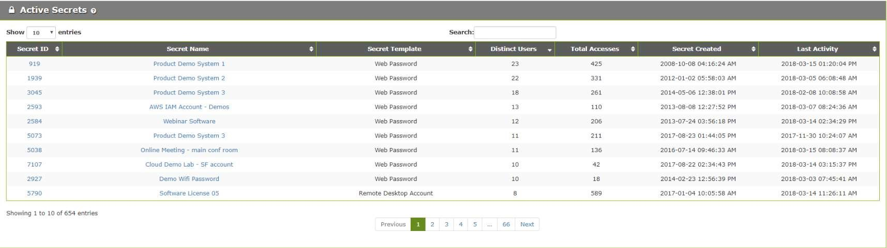
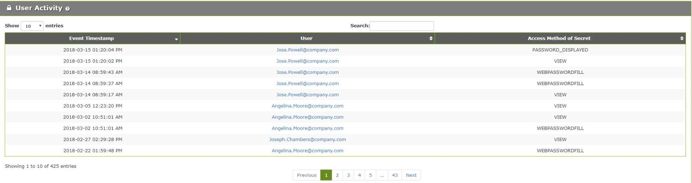
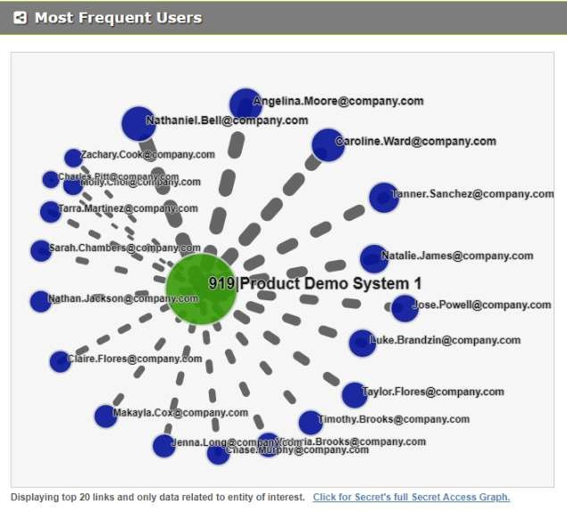
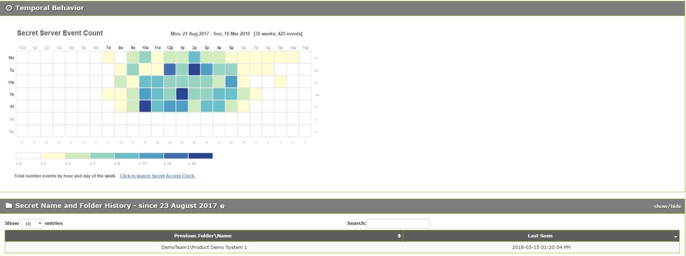

[title]: # (Secret Details)
[tags]: # (Privileged Behavior Analytics,PBA,Operations,Secret Details)
[priority]: # (4080)

# Secret Details

The **Secret Details** page can be used to investigate how a Secret is being accessed from the perspective of many types of data collected on it.
You can access Secret Details by navigating to **Details** > **Secrets**.

The Secret Details page will list all Secrets with Secret ID, Secret Name, Secret Template, the number of Distinct Users that have accessed the Secret, the Total Accesses by Users, the Secret Created date, and the date of the Last Activity.

If you click on any of the Secret names you will be directed to that Secret’s Details page, which shows the following:

* **User Activity**: lists the most recent 500 encrypted accesses for the Secret, when they occurred, who accessed it, and how it was accessed.

* **Most Frequent Users**: an animated representation of the top 20 users accessing the Secret the most; you can zoom into the graph by scrolling or right-click on any node or link to view more details

* **Temporal Behavior**: a chart showing all temporal data for the Secret organized by time of day and day of the week
  * the numbers across the bottom indicate the total events involving that Secret for that time of day
  * the values across the right side indicate the number of events involving that Secret for that day of the week
  * the legend at the bottom shows the number of events that correlate to the coloring of the chart blocks
    * mouse over a block to get the total number of accesses for that day of week and hour of day

* **Secret Name and Folder History**: lists any changes that have been made to the name of the Secret or the folder it is kept in inside Secret Server
