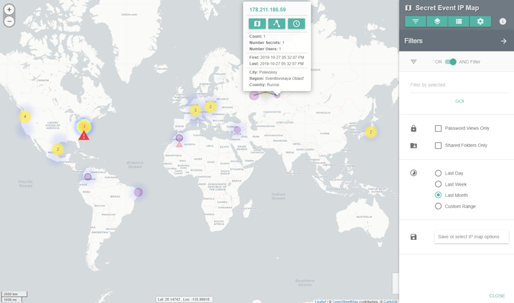
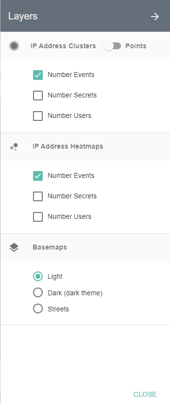
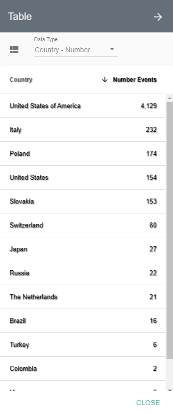
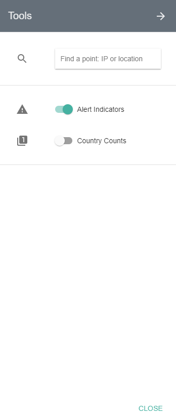
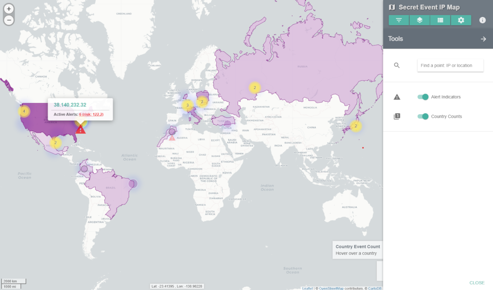

[title]: # (Secret Event IP Map)
[tags]: # (Secret Server,Privileged Behavior Analytics,PBA,Operations,Secret Event IP Map)
[priority]: # (4060)

# Secret Event IP Map

The **Secret Event IP Map** summarizes Secret Server activity by IP address and location. This is useful for Secret Servers that allow access from external IP addresses.

Summary views and information provide a high-level understanding of recent and historical Secret events. Any anomalous locations in the data can be quickly observed, analyzed, and acted upon.

## Map Key

The map shows by default the last week of IP address counts (purple circles) and active alerts (red triangles). You can click these features for further information.

Circle features sometimes have a gray or black outline, which means they are located only to the region (state) or country level, respectively.

## Map Navigation

The Map can be navigated like most web-based maps:

* Pan to different locations by clicking on an open area and dragging the mouse
* Zoom in or out using the mouse wheel, the buttons on the upper left, double-clicking (+ Shift), or dragging the mouse while holding Shift to select a zoom box

*NOTE: If no data appear, please go to the **Filters** menu and try turning off filters or expanding the time range. From the System Settings page, a default location can be entered for cases where only internal (private) IP addresses are present in the data.*

## Filters

The **Filters** menu (first menu button) provides options to limit data displayed based on user, Secret, IP address, location, and several related attributes.

* **OR AND Filter**: determines whether selected filters will be considered separately (OR) or together (AND)
* **Filter by selected**: filters the Map display by Secret, user, group, folder, IP Address, location, Secret importance, and template
* **Shared Folders Only**: unchecking this box will add Secret activity from users’ personal folders in Secret Server
* **Password Views Only**: turned on by default, this shows only Secret accesses, which include: web launches, passwords displayed, passwords copied to clipboard, Secrets edited, and Secrets exported; if turned off, all other Secret activity will be shown
* **Time Ranges**: by default, the Map will show activity from the last week; the Custom Range option allows selecting a start and end date to refine activity displayed
* **Save or select IP map options**: save filtered views of the Map to quickly recall significant events or complex filter combinations

## Layers

The **Layers** menu (second menu button) contains options to show circle layers as clusters (aggregated nearby points) or as individual points for the number of events, Secrets, or users active at each IP address.

There are also heatmaps and different basemaps that can be selected.

* Selecting the **Dark** basemap will change the entire map application to the dark theme.

## Table

The Table menu (third menu button) provides a sortable text-based list of key metrics (below) related to IP addresses.  Placing your mouse over any of the rows in the lists will highlight a point or country on the Map.

* **Country – Number Events**: shows the total number of IP events within each country
* **IP – Number Events**: shows list of IP addresses with the total number of events for each
* **IP – Number Secrets**: shows list of IP addresses with the total number of Secrets accessed or modified from each
* **IP – Number Users**: shows list of IP addresses with the total number of users for each
* **IP – First Active**: shows IP address list with date of first activity observed
* **IP – Last Active**: shows IP address list with date of last activity observed
* **IP – City**: shows IP address list with city of the location (if available)
* **IP – Region**: shows IP address list with region (state) of the location (if available)
* **IP – Country**: shows IP address list with country of the location

## Tools

The **Tools** menu (fourth menu button) provides a search function to find a specific IP address, city, region (state), or country among the data points currently loaded to the Map.  Clicking on a result will pop up details and re-zoom the map to the selected IP address.

The Tools menu also contains two additional data layer options:

* **Alert Indicators** show red triangles for IP addresses that have active alerts or warnings. Clicking on a triangle will show details on the number of alerts and total risk score.
* **Country Counts** show a semi-transparent layer shaded by the number of events taking place in each country. Clicking on a country will re-zoom the map to the selected country, and hovering the mouse over it will show the country name, flag, and number of events.

## Secret Event IP Map Info

Next to the menu buttons is an info icon that launches the **Secret Event IP Map Info** box, which contains basic statistics on the map data displayed, map instructions, and disclaimers.

