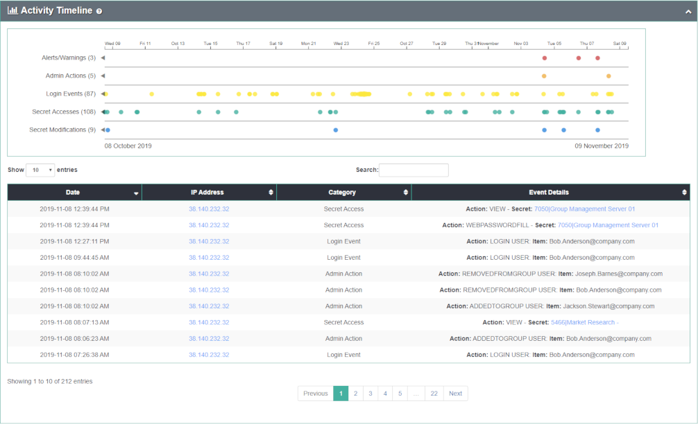
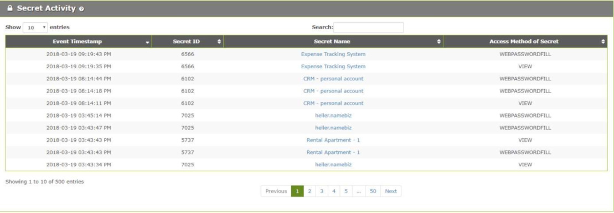

[title]: # (User Details)
[tags]: # (Privileged Behavior Analytics,PBA,Operations,User Details)
[priority]: # (4120)

# User Details

The **Active Users** page lists all Users, their Display Names, Account Type, total number of times they have accessed or modified Secrets, number of unique Secrets they have accessed, total number of administrative actions they have performed, when they were first seen in Privileged Behavior Analytics, and when they were last active.

The **User Details** page is the ideal place to dive deeper into a specific User’s behavior from the perspective of many types of data collected on them.
To see a user’s details page, click on the user’s name in the list of users.

* **Activity Timeline**: a chart showing when a User has performed Secret accesses, Secret modifications, or administrative actions in Secret Server, or has logged in or out of Secret Server over time
  * each activity is denoted by a symbol shown in the legend at the top
  * placing your mouse over any of the symbols in the graph will give more details on what the user did at that time
  * grabbing and moving the side buttons on the bottom chart will zoom the top chart

* **Most Frequent Secrets**: an animated representation of the top 20 most accessed Secrets by the User; you can zoom into the graph by scrolling, or right-click on any node or link to view more details

* **Temporal Behavior**: a chart showing all temporal data for the User organized by time of day and day of the week
  * the numbers across the bottom indicate the total events involving the User for that time of day
  * the values across the right side indicate the number of events involving the User for that day of the week
  * the legend at the bottom shows the number of events that correlate to the coloring of the chart blocks
  * mouse over a block to get the total number of accesses for that day of week and hour of day

* **User IP Address History**: lists any IP addresses they have accessed Secret Server from

* **Secret Activity**: lists the most recent 500 encrypted Secret accesses, when they occurred, the Secret IDs and names accessed, and how they were accessed

* **Secret Server Administrative Actions**: lists any administrative actions the User has performed in Secret Server, when it occurred, what the specific actions was, and if it affected any Secret Server Users

