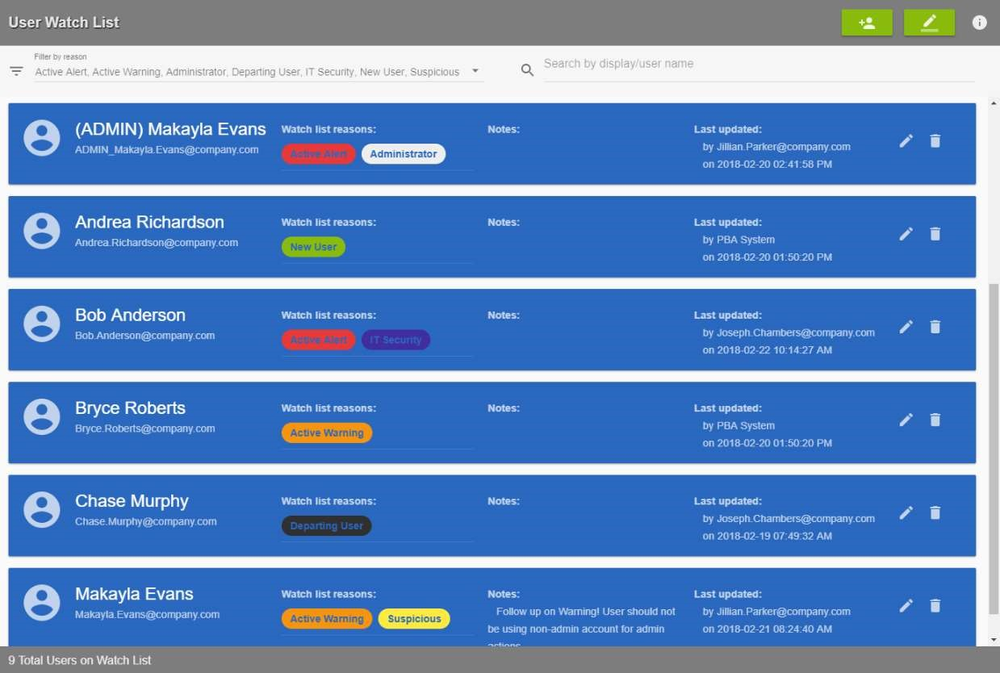
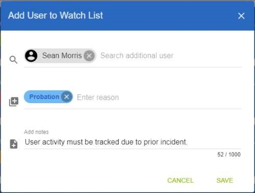
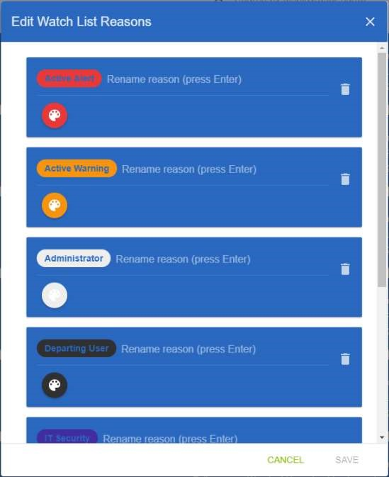

[title]: # (User Watch List)
[tags]: # (Privileged Behavior Analytics,PBA,Operations,User Watch List)
[priority]: # (4040)

# User Watch List

The **User Watch List** page provides a convenient location to track users of interest and easily access information about each.

By default, the Privileged Behavior Analytics (PBA) System adds to the Watch List new users and those with active Alerts and Warnings.

Upon clearing Alerts and Warnings, or when a new User has been active for 30 days, the System removes them from the Watch List. These automated actions can be disabled from the **System Settings** page (see [PBA Administration](../pba-admin/index.md) for more information).

On the right side of each User’s Watch List entry are buttons to edit (reasons and notes) or delete the entry. For Secret Server customers that have a Secret Server Custom URL, an additional lock icon will appear, which links to the User’s Edit page in Secret Server.

To add a Secret Server URL for direct linking:

* in Secret Server, hover over the Admin button in the toolbar
* select Configuration > Edit
* set the **Secret Server Custom URL**—the URL will be passed to Privileged Behavior Analytics in the next metadata upload

Users can be added to the Watch List by clicking the Add User icon at the top right of the page. Multiple new or existing users can be added to the list along with a list of reasons and notes.

* For existing Watch List users, the reasons and notes will be appended to their current reasons list and notes.

To make changes to a reason, click the **Edit Reasons** button on the top right side of the toolbar. The current list of reasons will appear with options to change the name or color or to delete the reason from the Watch List. These changes affect all Watch Listed Users with the edited reason and are not tracked in the Last Updated information.
