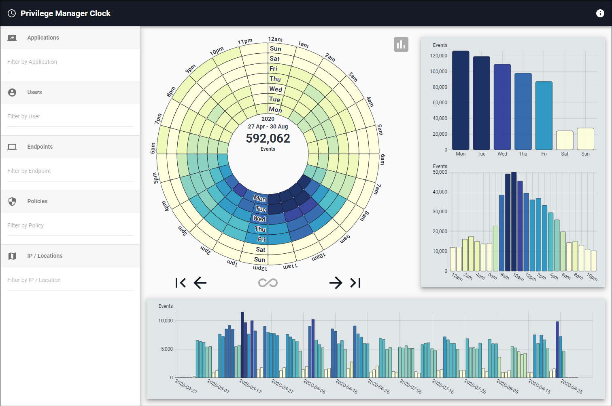

[title]: # (Application Clock)
[tags]: # (privilege manager)
[priority]: # (4510)

# Application Clock

The **Application Clock** provides a temporal overview of Privilege Manager event data organized by: Application, User, Endpoint, Policy, and IP / Location. It visualizes the distribution and concentration of activities for a given time range.

The circular chart is called a data clock and shows event counts by hour and day of the week (starting with the inner ring and spiraling clockwise outward). The charts in the right panel show totals by day of the week and hour of the day. The bottom panel shows daily totals for the entire activity period.

The coloring of the graphs range from white to dark blue.

* White means no activity.
* Dark blue means a lot of activity.

The center of the data clock displays the number of events represented and the date range when they occurred. Click this text to change units in the upper three charts. ("% of Total" is the amount contained within each bar compared to the selected week's total. "% of Max" is the amount contained within each bar compared to the selected week's max bar value for a given chart. Bar coloring for the default Events (count) option is relative to all weeks' data if a single week is selected.)

To move back and forth through specific weeks, use the left and right arrows at the base of the data clock. If you wish to hide the side and bottom bar charts from the display, you can click the gray chart button to the top right of the data clock. The bottom chart allows panning (click and drag left/right) and zooming (scroll up/down).  Double-click to reset the view.

* You can filter the temporal data by clicking into one of the input lines on the left side and typing the name of:
  * Application, File Hash, or File Name
  * User, Group, Name, or User ID
  * Endpoint or Endpoint ID
  * Policy or Policy ID
  * IP address, City, Region, or Country
* Each "Filter by ___" input also accepts "*" (wildcard) and uppercase "AND", "NOT", and "OR" searches (but no mixing AND, NOT, OR, nor parentheses).
* Selecting a filter from one of the lists will refresh the graphs to reflect only events within the data range that are related to that application, user, endpoint, policy, or IP.
* If you refine by an application and wish to see which users accessed it on a particular day or at a certain time, you can right-click on the corresponding bar in any of the graphs and then click on the name of the application.
* Likewise, if you refine by a user and wish to see which applications they accessed on a particular day or at a certain time, you can right-click on the corresponding bar and click on the name of the user.
* Adding a filter from two different data types will perform an "AND" operation between them.  For example, filtering on an application and a user will only show events where the user accessed that application.

*Note that all charts and timestamps are based on the Local Timezone in System Settings.*
