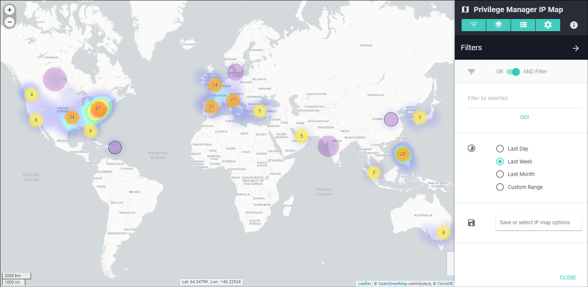
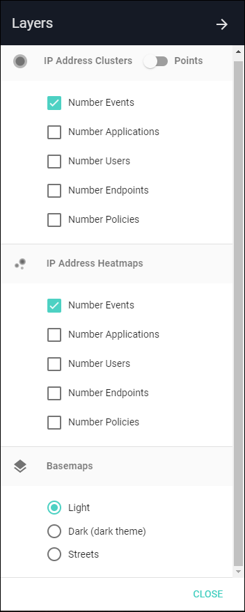
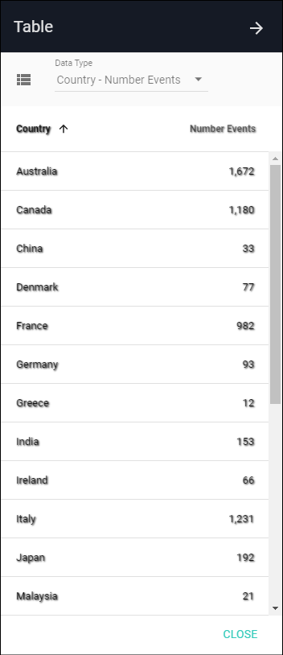

[title]: # (IP Map)
[tags]: # (privilege manager)
[priority]: # (4540)

# Application IP Map

The **Application IP Map** summarizes user to application activity by IP address and location. This is useful for Privilege Manager endpoints that access applications from public IP addresses.

Summary views and information provide a high-level understanding of recent and historical events. Any anomalous locations in the data can be quickly observed, analyzed, and acted upon.

## Map Key

The map shows by default the last week of IP address counts (purple circles) and active alerts (red triangles). You can click these features for further information.

Circle features sometimes have a gray or black outline, which means they are located only to the region (state) or country level, respectively.

## Map Navigation

The Map can be navigated like most web-based maps:

* Pan to different locations by clicking on an open area and dragging the mouse
* Zoom in or out using the mouse wheel, the buttons on the upper left, double-clicking (+ Shift), or dragging the mouse while holding Shift to select a zoom box

## Filters

The **Filters** menu (first menu button) provides options to limit data displayed based on user, application, IP address, location, and several related attributes.

* **OR AND Filter**: determines whether selected filters will be considered separately (OR) or together (AND)
* **Filter by selected**: filters the Map display by application, user, endpoint, group, IP Address, location, and policy
* **Time Ranges**: by default, the Map will show activity from the last week; the Custom Range option allows selecting a start and end date to refine activity displayed
* **Save or select IP map options**: save filtered views of the Map to quickly recall significant events or complex filter combinations

*NOTE: If no data appear, try turning off filters or expanding the time range. From the System Settings page, a default location can be entered for cases where only internal (private) IP addresses are present in the data.*

## Layers

The **Layers** menu (second menu button) contains options to show circle layers as clusters (aggregated nearby points) or as individual points for the number of events, applications, users, endpoints, or policies active at each IP address.

There are also heatmaps and different basemaps that can be selected.

* Selecting the **Dark** basemap will change the entire map application to the dark theme.

## Table

The Table menu (third menu button) provides a sortable text-based list of key metrics (below) related to IP addresses.  Placing your mouse over any of the rows in the lists will highlight a point or country on the Map.

* **Country – Number Events**: shows the total number of IP events within each country
* **IP – Number Events**: shows list of IP addresses with the total number of events for each
* **IP – Number Applications**: shows list of IP addresses with the total number of Secrets accessed or modified from each
* **IP – Number Users**: shows list of IP addresses with the total number of users for each
* **IP – Number Endpoints**: shows list of IP addresses with the total number of endpoints for each
* **IP – Number Policies**: shows list of IP addresses with the total number of policies for each
* **IP – First Active**: shows IP address list with date of first activity observed
* **IP – Last Active**: shows IP address list with date of last activity observed
* **IP – City**: shows IP address list with city of the location (if available)
* **IP – Region**: shows IP address list with region (state) of the location (if available)
* **IP – Country**: shows IP address list with country of the location

## Tools

The **Tools** menu (fourth menu button) provides a search function to find a specific IP address, city, region (state), or country among the data points currently loaded to the Map.  Clicking on a result will pop up details and re-zoom the map to the selected IP address.

The Tools menu also contains two additional data layer options:

* **Alert Indicators** show red triangles for IP addresses that have active alerts or warnings. Clicking on a triangle will show details on the number of alerts and total risk score.
* **Country Counts** show a semi-transparent layer shaded by the number of events taking place in each country. Clicking on a country will re-zoom the map to the selected country, and hovering the mouse over it will show the country name, flag, and number of events.

## Application IP Map Info

Next to the menu buttons is an info icon that launches the **Application IP Map Info** box, which contains basic statistics on the map data displayed, map instructions, and disclaimers.

## Disclaimers

IP address locations are prone to change and can be inaccurate and imprecise, sometimes located to only the region or country level. This app shows only the most recent available IP address location information, which might have been updated since the time an IP address was last accessed. Location data are derived from MaxMind's GeoLite2. All metadata are based on the latest update (even for past timeframes). Timestamps are based on the Local Timezone in System Settings.
