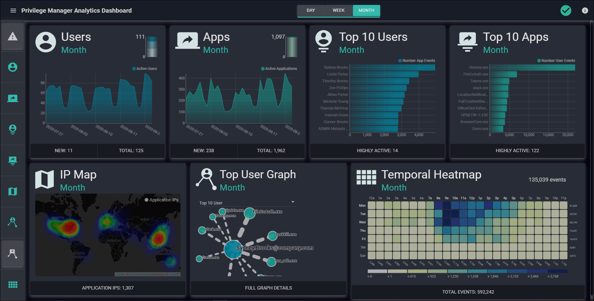

[title]: # (Analytics Dashboard)
[tags]: # (privilege manager)
[priority]: # (4500)

# Privilege Manager Analytics Dashboard

PBA’s **Analytics Dashboard** page collects commonly used tools and views so you can easily recognize anything that would be out of the ordinary for your Privilege Manager environment.

* Multiple widgets present at-a-glance data visuals that cycle through views of activity for the last day, week, and month.
* The widgets activate or deactivate when you click the controls for each on the left side of the Dashboard.
* Cycling pauses on the data view for the last day, week, and month when you click on the Day, Week, and Month controls.
* Additional settings (dashboard theme, widget settings, cycle duration) are accessible through the three horizontal bars icon on the top left side.
* The Alerts tile is currently only available for Secret Server. In the left sidebar, click the alert icon to toggle off the tile.
