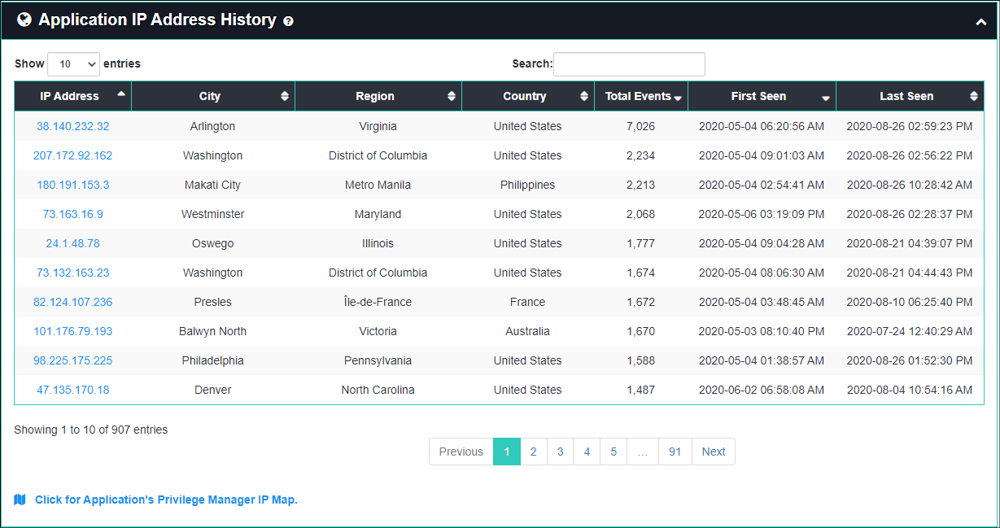

[title]: # (Application Details)
[tags]: # (privilege manager)
[priority]: # (4570)

# Application Details

The **Application Details** page can be used to investigate how an application is being accessed from the perspective of many types of data collected on it.
You can access Application Details by navigating to **(Privilege Manager Analytics)** > **Details** > **Applications**.

The Application Details page lists all applications and includes summary statistics and links to further details.  The "No Policy" checkbox is on by default and shows only applications without a policy applied.  Uncheck to see all applications.

If you click on any of the application names or file hashes you will be directed to that entity’s details page, which shows the following:

* **App Stats**: lists key statistics such as total number of events and users, time range, and last event action

* **Activity Timeline**: shows all activity for the application, including timestamp, user, endpoint, policy, and IP address
  * mouse over a colored circle for details on a particular event
  * the chart can be panned left and right by dragging or zoomed by scrolling, which also filters data in the table

* **Most Frequent Users**: an animated representation of the top 20 users accessing the application the most; you can zoom into the graph by scrolling or right-click on any node or link to view more details

* **Temporal Behavior**: a chart showing all temporal data for the application organized by hour of day and day of the week
  * the numbers across the bottom indicate the total events involving that application for that hour of day
  * the values across the right side indicate the number of events involving that application for that day of the week
  * the legend at the bottom shows the number of events that correlate to the coloring of the chart blocks
    * mouse over a block to get the total number of events for that day of week and hour of day

* **Version History (optional)**: a table of the various version numbers, number of users, and time range for each file hash (when an application name (not hash) details page was selected)

* **IP Address History**: a table of locations, total number of events, and time range of each IP address used to access the application

