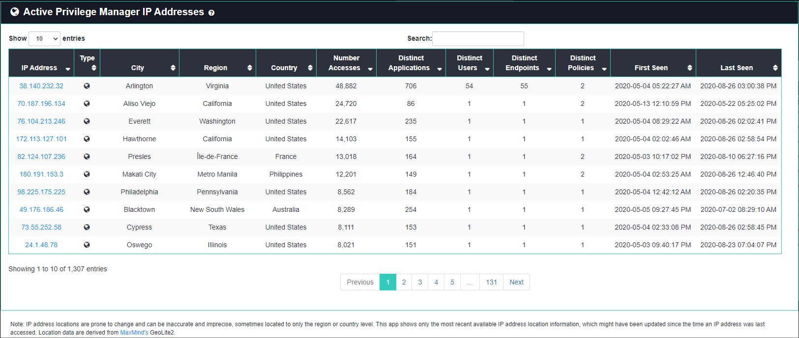
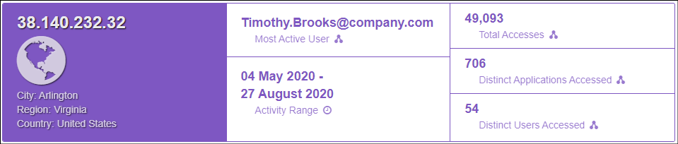
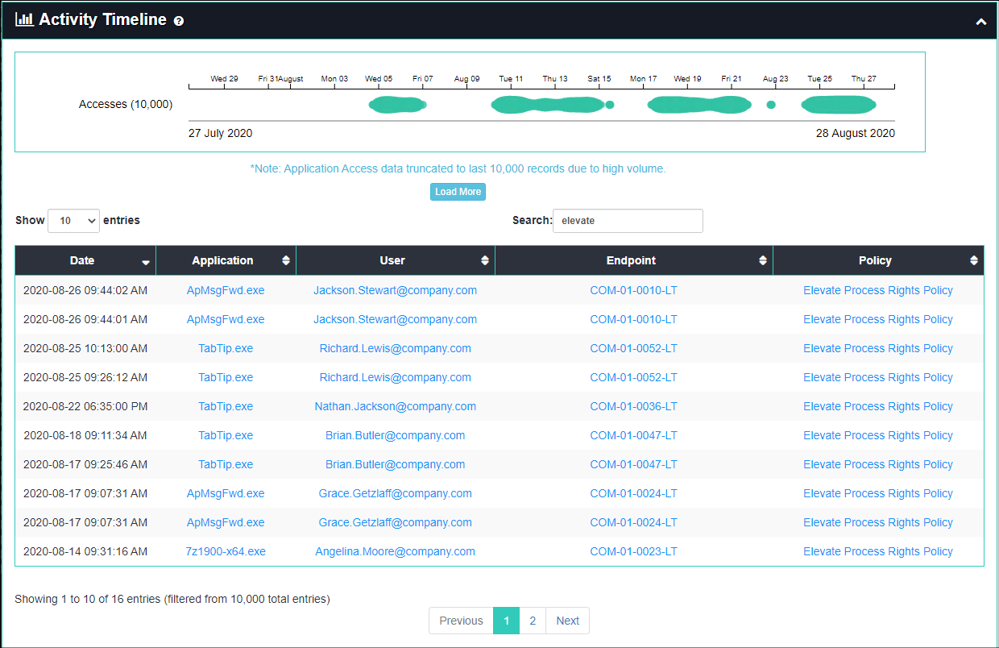
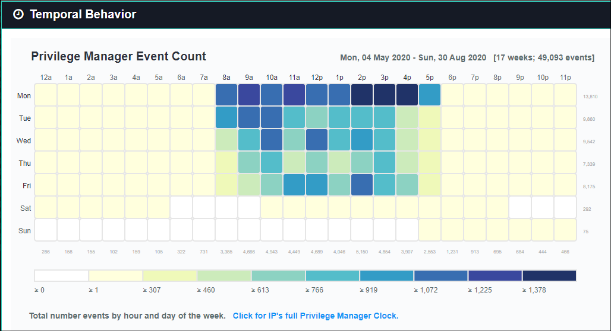

[title]: # (IP Address Details)
[tags]: # (privilege manager)
[priority]: # (4610)

# IP Address Details

The **IP Address Details** page can be used to investigate IP address activity from the perspective of many types of data collected on it.
You can access IP Address Details by navigating to **(Privilege Manager Analytics)** > **Details** > **IP Addresses**.

The IP Address Details page lists all IP addresses and includes summary statistics and links to further details.  If you click on any of the IP addresses you will be directed to the details page, which shows the following:

* **IP Address Stats**: lists key statistics such as total number of events, time range, and most active user

* **Activity Timeline**: shows all application access activity for the IP address, including timestamp, endpoint, user, and IP address
  * mouse over a colored circle for details on a particular event
  * the chart can be panned left and right by dragging or zoomed by scrolling, which also filters data in the table

* **Temporal Behavior**: a chart showing all temporal data for the IP address organized by hour of day and day of the week
  * the numbers across the bottom indicate the total events involving that IP address for that hour of day
  * the values across the right side indicate the number of events involving that IP address for that day of the week
  * the legend at the bottom shows the number of events that correlate to the coloring of the chart blocks
    * mouse over a block to get the total number of events for that day of week and hour of day

