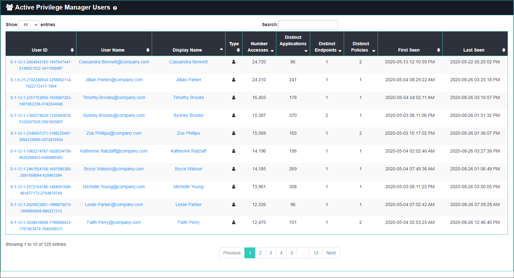
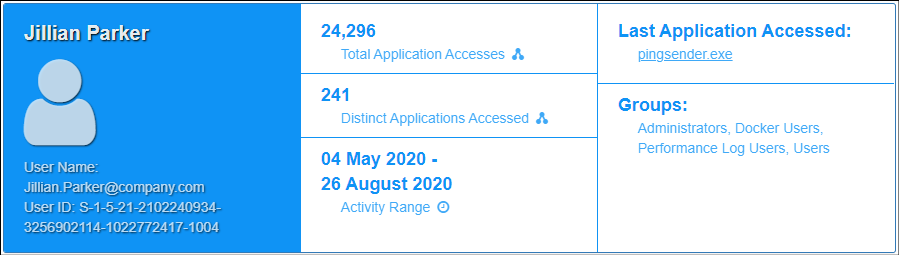
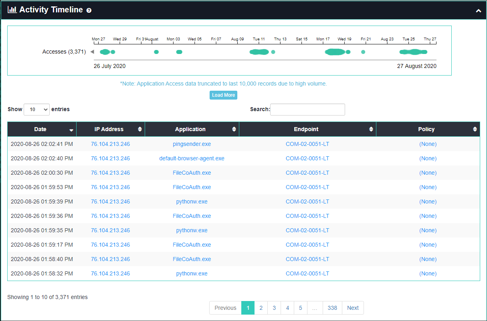
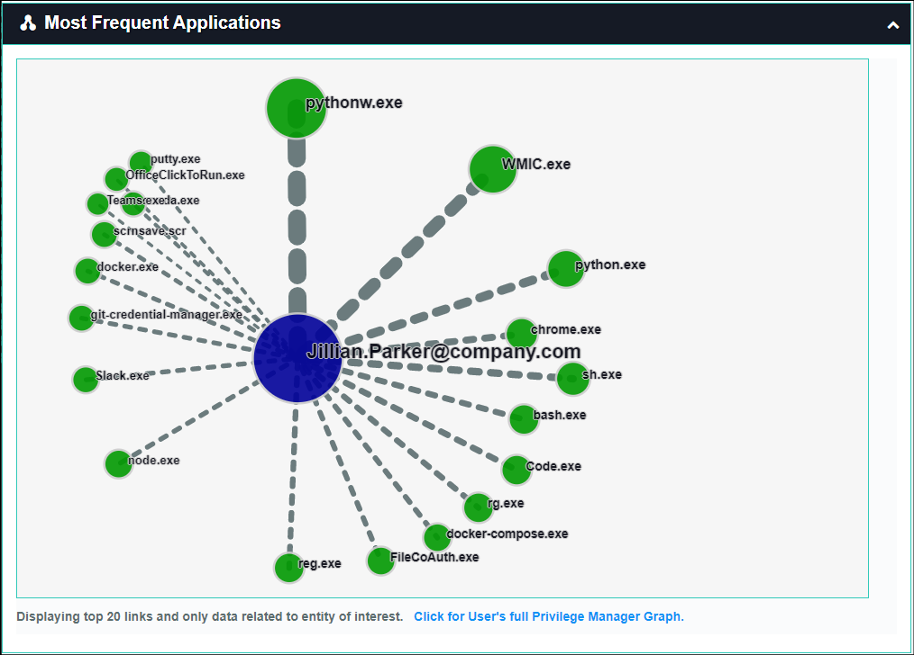
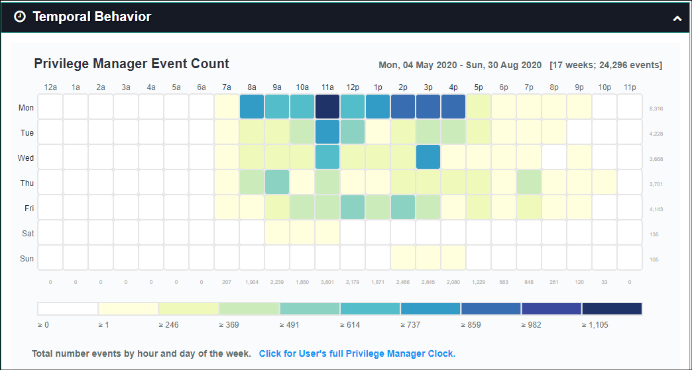
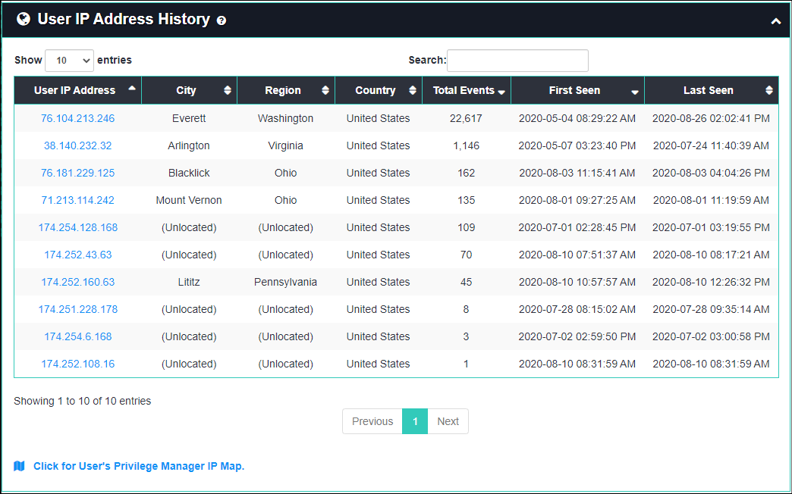

[title]: # (User Details)
[tags]: # (privilege manager)
[priority]: # (4580)

# User Details

The **User Details** page can be used to investigate user activity from the perspective of many types of data collected on it.
You can access User Details by navigating to **(Privilege Manager Analytics)** > **Details** > **Users**.

The User Details page lists all users and includes summary statistics and links to further details.  If you click on any of the user names or IDs you will be directed to that entity’s details page, which shows the following:

* **User Stats**: lists key statistics such as total number of events and applications, time range, and last event action

* **Activity Timeline**: shows all application access activity for the user, including timestamp, endpoint, policy, and IP address
  * mouse over a colored circle for details on a particular event
  * the chart can be panned left and right by dragging or zoomed by scrolling, which also filters data in the table

* **Most Frequent Applications**: an animated representation of the top 20 applications the user accesses most; you can zoom into the graph by scrolling or right-click on any node or link to view more details

* **Temporal Behavior**: a chart showing all temporal data for the user organized by hour of day and day of the week
  * the numbers across the bottom indicate the total events involving that user for that hour of day
  * the values across the right side indicate the number of events involving that user for that day of the week
  * the legend at the bottom shows the number of events that correlate to the coloring of the chart blocks
    * mouse over a block to get the total number of events for that day of week and hour of day

* **IP Address History**: a table of locations, total number of events, and time range of each IP address the user was active on

