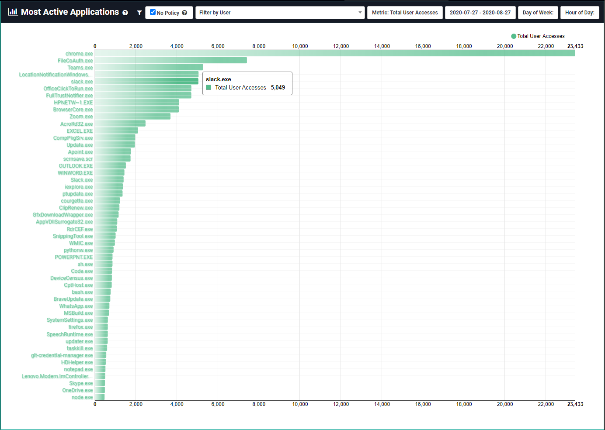

[title]: # (Most Active Applications)
[tags]: # (privilege manager)
[priority]: # (4550)

# Most Active Applications

**Most Active Applications** ranks the top 50 most accessed applications for given filter criteria. To see this page, navigate to **Privilege Manager Analytics** or **Analytics** > **Most Active Applications**.

The list contains the application name and number of events for each of the top 50 applications, using a bar chart as visual reference.

* By default, you will see the top 50 applications in your Privilege Manager environment for the past month.
* The "No Policy" checkbox shows by default the applications accessed that have no policy applied.  Uncheck to see all application events.
* You can further filter the list by a user, total or distinct accesses, or a specific timeframe.
* Clicking on an application name or bar in the list will take you to its **Application Details** page.
