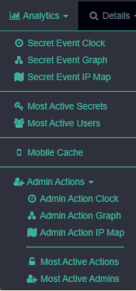

[title]: # (Admin Actions)
[tags]: # (secret server)
[priority]: # (4100)

# Admin Actions

PBA also contains a suite of analytics based on Administrator Actions in Secret Server. Navigate to **Analytics > Admin Actions** to view the available pages.

Similar to the Secret Event Clock, Graph, and IP Map, there are pages that show administrators and Secret Server Actions instead of users and Secrets. Likewise, the **Most Active Actions** and **Most Active Admins** pages allow you to filter down the top 50 of each and easily access details pages.
