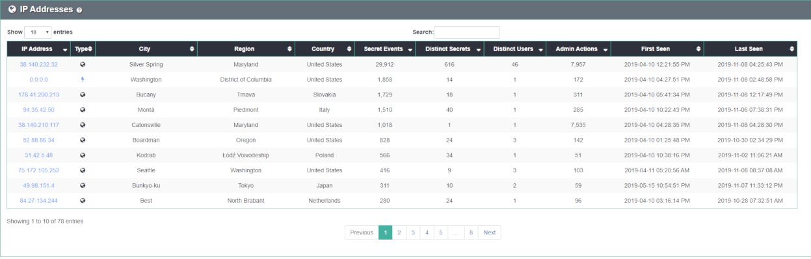
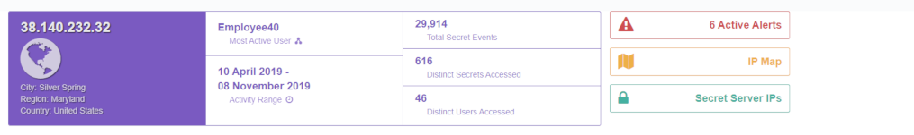
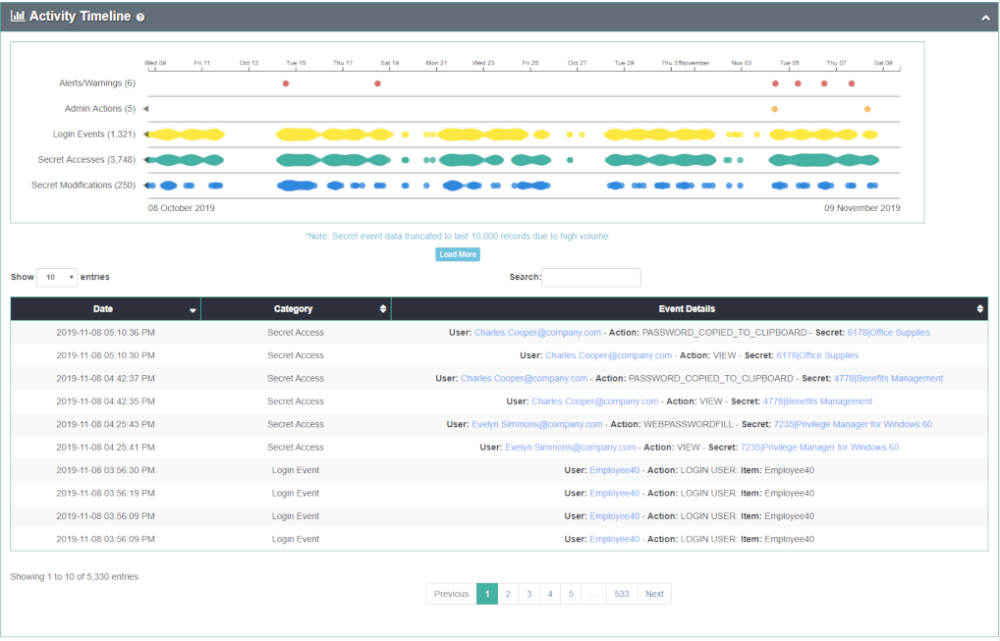
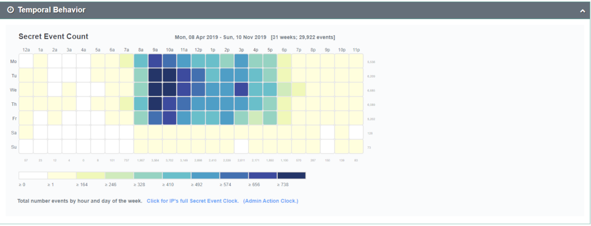

[title]: # (IP Address Details)
[tags]: # (Secret Server,Privileged Behavior Analytics,PBA,Operations,IP Address,Details)
[priority]: # (4130)

# IP Address Details

The **IP Addresses** page (**Details** > **IP Addresses**) lists all IP addresses, their type (Public or Private), City, Region, Country, the number of Secret accesses plus modifications, the number of unique Secrets accessed, the number of unique users accessing Secrets, the number of administrator actions performed (including logins), and the first and last time PBA observed the IP address in data.

Click on an IP address to open the IP Details page.

The sections display a variety of detailed information.

**Activity Timeline**: a chart showing when an IP address was used to perform Secret accesses, modifications, and administrative actions in Secret Server (including login events).  Any active or past alerts or warnings are shown as well.

* mouse over a colored circle for details on a particular event
* the chart can be panned left and right by dragging or zoomed by scrolling, which also filter data in the table

**Temporal Behavior**: a chart showing all temporal data for the IP address organized by time of day and day of the week

* the numbers across the bottom indicate the total events involving the IP address for that time of day
* the values across the right side indicate the number of events involving the IP address for that day of the week
* the legend at the bottom shows the number of events that correlate to the coloring of the chart blocks
* mouse over a block to get the total number of events for that day of week and hour of day

