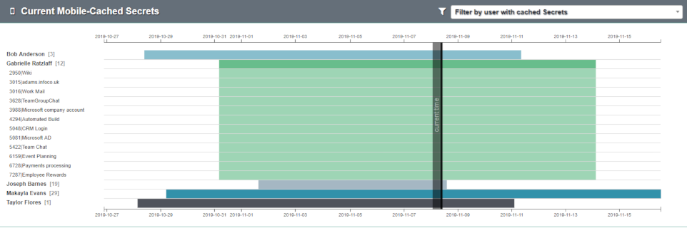

[title]: # (Mobile Cache)
[tags]: # (secret server)
[priority]: # (4090)

# Mobile Cache

Mobile Cache shows timelines for available cached Secrets organized by user.  If any users have currently cached Secrets available from a Thycotic mobile or desktop application, it will be shown here.

You can view mobile-cached Secrets by navigating to **Analytics > Mobile Cache**.

If multiple users have current mobile-cached Secrets, the filter at the top can limit the chart view to a specific user.

If any users have current mobile-cached Secrets, the timeline of the Secrets’ availability is shown in the chart.

* Clicking on a user’s bar will expand the view and reveal Secret names.
* Clicking the top bar again will collapse the Secret bars.
* You can drag the chart to pan left or right or scroll up or down to zoom the view.
* Scroll the entire page up or down from the right side of the window.
* Clicking on any of the user or Secret names will launch the details page.
