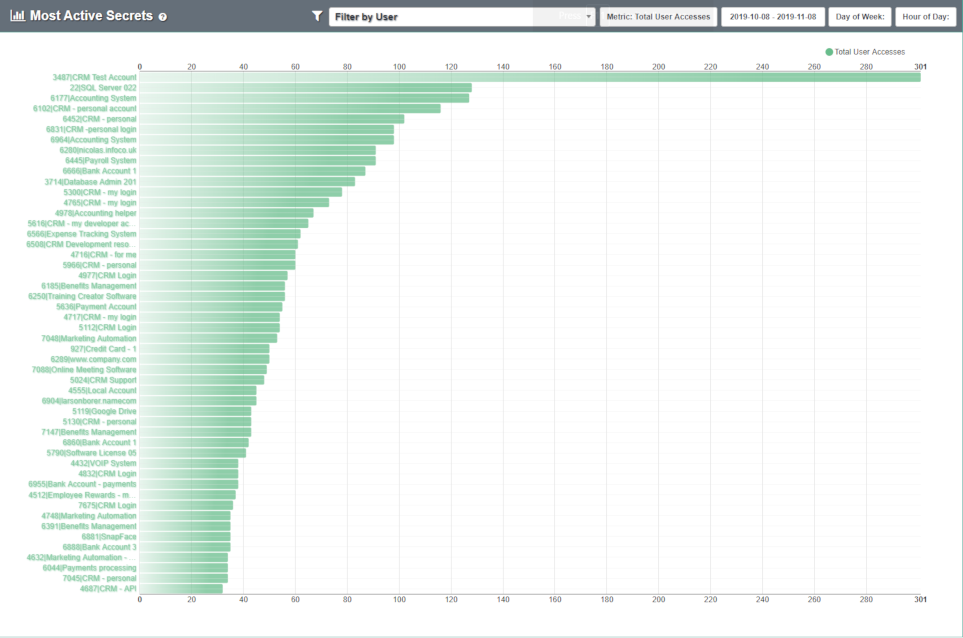

[title]: # (Most Active Secrets)
[tags]: # (secret server)
[priority]: # (4070)

# Most Active Secrets

**Most Active Secrets** ranks the top 50 most accessed Secrets. To see this, navigate to **Analytics** > **Most Active Secrets**.

The list contains the Secret ID, Secret Name, and number of access events for each of the 50 secrets, using a bar chart as visual reference.

* By default, you will see the top 50 Secrets in your Secret Server environment for the past month.
* You can further filter the list by User, total or distinct accesses, or specific timeframe.
* Clicking on a Secret in the list will take you to its **Secret Details** page.
