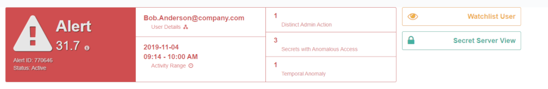

[title]: # (Privileged Behavior Alerts)
[tags]: # (Secret Server,Privileged Behavior Analytics,PBA,Operations,Alerts,Severity,Score,Range,Admin Actions,Temporal Behavior,Historical Behavior)
[priority]: # (4020)

# Privileged Behavior Alerts

The Privileged Behavior Alerts page (**Alerts** > **Privileged Behavior Alerts**) displays events in Secret Server that do not align with normally observed behaviors. This includes the capacity to display Alerts for circumstances you define (see the [PBA Administration](../pba-admin/index.md) article).

Use the search field to locate specific Alerts by searching on text from any of the rows in the table. Columns include:

* **Severity**: whether the event justified an Alert (serious event) or a Warning (minor event)
* **Score**: the numerical score given to the event depending on its severity and the severity of incorporated events
* **User**: the Secret Server User who caused the Alert; clicking their name opens the **User Details** page
* **Range of Activity**: the time span within which the Alert occurred; includes an optional timeline graphic
* **IP Addresses**: the IP addresses used during the alert period with links to each IP Details page
* **Secret Accesses**: any Secrets accessed during the time span of the Alert that contributed to the Alert; clicking on the Secrets opens the **Secret Details** page
* **Admin Actions**: any administrative actions taken in Secret Server during the time span of the Alert that may have contributed to the Alert; clicking on the Admin Actions listed displays the table of all administrative activity for that User
* **Temporal Behavior**: a time entry will be listed here if the Alert occurred at a time the User does not normally access the Secrets involved in the Alert; clicking on the time entry will display the User’s Temporal Data.
* **Actions**: button links open the **Alert Details** page, **Dismiss** the alert as normal behavior, or **Clear & Watch** the alert as abnormal behavior
  * To further investigate the Alert, log actions you have taken on the Alert, adjust the importance of any involved Secrets, or provide feedback to Thycotic on the usefulness of the Alert, click **Details**
  * Clicking **Dismis**s or **Clear & Watch** will remove the alert from the page and save it to **Historical Behavior Alerts**

## Historical Behavior Alerts

The Historical Behavior Alerts page archives Alerts after they have been cleared from an Active state.

You can reach the Historical Behavior Alerts by navigating to **Alerts** > **Historical Behavior Alerts**.

In viewing Historical Behavior Alerts, note these fields:

* **Changed by**: the PBA User who cleared the Alert
* **Notes**: notes left on the Alert before it was cleared
