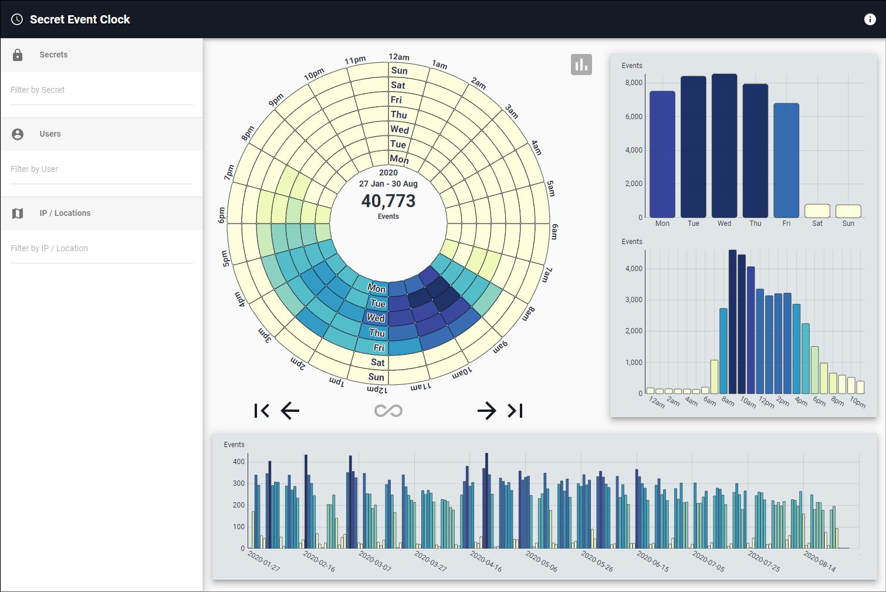

[title]: # (Secret Event Clock)
[tags]: # (secret server)
[priority]: # (4040)

# Secret Event Clock

The **Secret Event Clock**, in the Analytics section of PBA, provides a temporal overview of Secret Server activity. It visualizes the distribution and concentration of activities for a given time range.

The coloring of the graphs range from white to dark blue.

* White means no activity.
* Dark blue means a lot of activity.

The center of the circular chart displays the number of events represented and the date range when they occurred.

* You can filter the temporal data by searching in the three boxes on the left for a:
  * Secret, Folder, or Secret Importance Level
  * User, Account Type, Group, Name, or User ID
  * IP address, City, Region, or Country
* This will refresh the graphs to reflect only events within the data range that are related to that Secret, User, or IP.
* If you refine by a Secret and wish to see which Users accessed that Secret on a particular day or at a certain time, you can right-click on the corresponding bar in any of the graphs and then click on the name of the Secret.
* Likewise, if you refine by a User and wish to see which Secrets they accessed on a particular day or at a certain time, you can right-click on the corresponding bar and click on the name of the User.

To move back and forth through specific weeks, use the left and right arrows at the base of the circular chart. If you wish to hide the side and bottom bar charts from the display, you can click the gray chart button to the top right of the circular chart.
