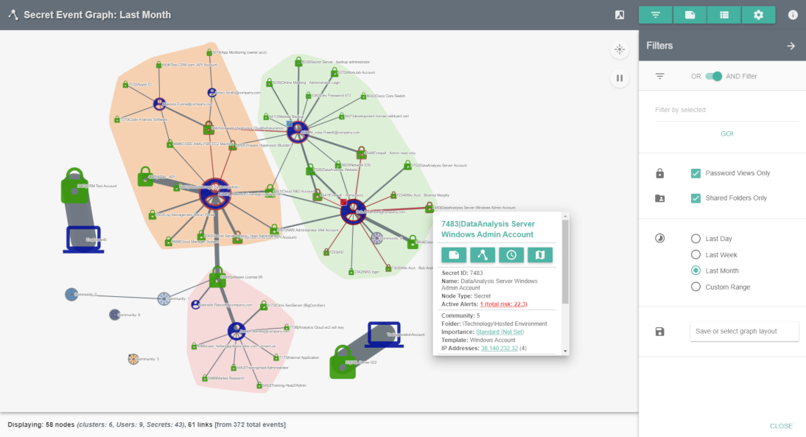
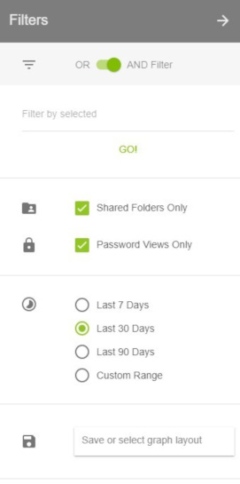
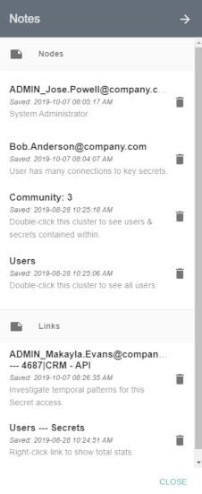
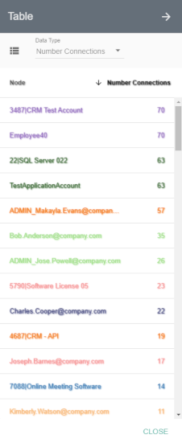
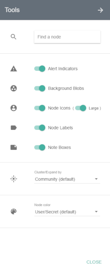

[title]: # (Secret Event Graph)
[tags]: # (secret server)
[priority]: # (4050)

# Secret Event Graph

The Secret Event Graph can be used to explore the behaviors of Secret Server users at a glance.

The graph is animated by default. You can pause the animation by clicking on the pause button at the top right of the graph area. Above the pause button is another button that will allow you to expand or collapse all nodes with a single click. You can also expand or collapse individual clusters by double clicking on them.

Each initial node circle, or Community, is a collection of users who are accessing similar Secrets. The larger the Community, the more users and Secrets there are inside it.

Communities may also have lines, or links, connecting them to other Communities. The links are an indication that a user or users within a Community are accessing Secrets that exist in another Community, indicating a possibility of accesses outside a user’s responsibility. Thicker links represent more accesses between Communities.

When you expand (double-click) a Community, you can see all the users and Secrets it contains. The size of each node indicates how many accesses it has and the thickness of links follows the same principal.

Community, User, and Secret nodes may be outlined by a shade of red. If this is the case, there is an active alert for a user and/or Secret and more information can be found by right clicking on the affected nodes and observing active alerts or by navigating to the **Alerts > Privileged Behavior Alerts** page.

Whether a Community is expanded or not, you can right click on any node or link on the Secret Event Graph to add notes or see further details.

The icon to the left of the menu buttons will toggle the Graph between light and dark themes.

## Filters

The Filters menu (three horizontal lines button) provides options to limit the number of nodes and links displayed.

* **OR AND Filter**: determines how filters will be applied to the Secret Event Graph
* **Filter by selected**: lets you filter the Secret Event Graph display by Secret, User, Group, Folder, IP Address, Secret Importance, and Template
* **Shared Folders Only**: unchecking this box will add Secret access activity from users’ Personal Folders in Secret Server
* **Password Views Only**: turned on by default, this shows only Secret accesses, which include: web launches, passwords displayed, passwords copied to clipboard, Secrets edited, and Secrets exported; if turned off, all other Secret activity will be shown
* **Time Ranges**: by default, the Secret Event Graph will show activity from the last week; the Custom Range option allows selecting a start and end date to refine activity displayed
* **Save or select graph layout**: you may choose to save filtered views of the Secret Event Graph to quickly recall significant access landscapes

## Notes

The Notes menu can be accessed by clicking the green button depicting a note with a folded corner at the top right of the Secret Event Graph page.

* All notes on nodes and links are listed here. You can edit any note by clicking on it or delete a note by clicking on the trashcan icon to the right of the note.
* Notes can be created by right-clicking on a node (circle) or link (line) in the Secret Event Graph. A small square of the color selected will appear on the node or link after the note is created.
* Hovering over the square or a note in the Notes menu will briefly highlight the note square on the Graph.

## Table

The Table menu can be accessed by clicking the green button between the Notes and Tools buttons at the top right of the Secret Event Graph page.

This menu gives you a full, sortable text-based list of all User and Secret node metrics. Placing your mouse over any of the node names in the lists will highlight that node on the Secret Event Graph if the Community it is in is expanded.

* **Community** lists User and Secret nodes and the Community number they are in
* **Secret/User** lists User and Secret node names and whether each is a User or Secret
* **Number Connections** lists User and Secret nodes and how many accesses they have had or performed on other nodes
* **Number Unique** lists User and Secret nodes and how many unique Secrets or users, respectively, they are connected to
* **Last Active** lists User and Secret nodes and the timestamp of the last activity each had
* **First Active** lists User and Secret nodes and the timestamp of the first activity each had recorded in PBA
* **Social Network Metrics** lists User and Secret nodes and the numerical value of the selected metric

## Tools

The Tools menu (cogwheel button) allows you to customize what is displayed on the graph.

* **Search**: At the top of the menu is a search field where you can enter the name of a User or Secret to highlight that specific node on the Secret Event Graph. Press Enter to repeat the animation.
* **Alert Indicators**: turned on by default, this will outline Secret and User nodes in a shade of red based on whether it has an active alert; the redder a node is the higher the total alert risk
* **Background Blobs**: turned on by default, these surround all nodes in an expanded Community with a color similar to that of the collapsed Community
* **Node Icons**: turned on by default, this shows icons in place of circles for each user or Secret node. The size of the icon can be changed using the **Large** switch.
* **Node Labels**: turned on by default, these are Community numbers, Secret names, and User names shown next to each node
* **Note Boxes**: turned on by default, these represent notes that have been placed on any nodes or links
* **Cluster/Expand by**: by default, all nodes will be clustered by Communities; you can select the dropdown here to choose to cluster nodes by Secrets and users
* **Node Color**: there are multiple options for choosing how the nodes within an expanded Community are colored:
  * **Community**: all Secret and User nodes will be the color of the Community when it is collapsed
  * **Secret/User**: the User nodes are colored blue and Secret nodes are colored green (default coloring)
  * **Number Connections**: Secret and User node colors will range from white to red; the redder a node is, the more active it is
  * **Number Unique**: Secret nodes will always be white; User nodes will range from white to red, and the redder a node is, the more unique accesses it has
  * **Last Active**: Nodes will range from white to red with recent activity being more red
  * **First Active**: Nodes will range from white to red with earlier activity being more red
  * **Social Network Metrics**: these options can reveal important Secrets or users in the network
