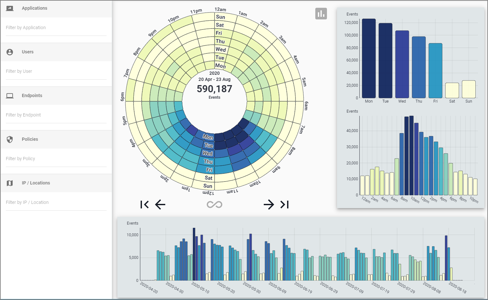

[title] # (Application Clock)
[tags] # (privilege manager)
[priority] # (4500)
# Application Clock

This application shows Privilege Manager event data organized by: Application, User, Endpoint, Policy, IP / Location. The circular chart is called a data clock and shows event counts by hour and day of the week (starting with the inner ring and spiraling clockwise outward). The charts in the right panel show totals by day of the week and hour of the day. The bottom panel shows daily totals for the entire activity period.

Enter on the left panel an identifier for the entity type of interest to filter temporal data. Add multiple names within one category ("OR" operation) to show combined data for that category. For example, filtering on two Applications will show total activity for both.

Filtering on both Applications and Users performs an "AND" operation between them. For example, filtering on a given Application and User will show only that Application's activity for that User.

Each "Filter by ___" input also accepts "*" (wildcard) and uppercase "AND", "NOT", and "OR" searches (but no mixing AND, NOT, OR, nor parentheses).

Click the left/right arrows to move the data clock forward or back a week. Click the infinity icon to show all data.

Hover over icons or right-click bars or wedges for further details.

Click the center text of the data clock to change units in the upper three charts. ("% of Total" is the amount contained within each bar compared to the selected week's total. "% of Max" is the amount contained within each bar compared to the selected week's max bar value for a given chart. Bar coloring for the default Events (count) option is relative to all weeks' data if a single week is selected.)

Bottom chart: drag to pan left/right, scroll up or down to zoom, and double-click to reset.

All charts and timestamps are based on the Local Timezone in System Settings.