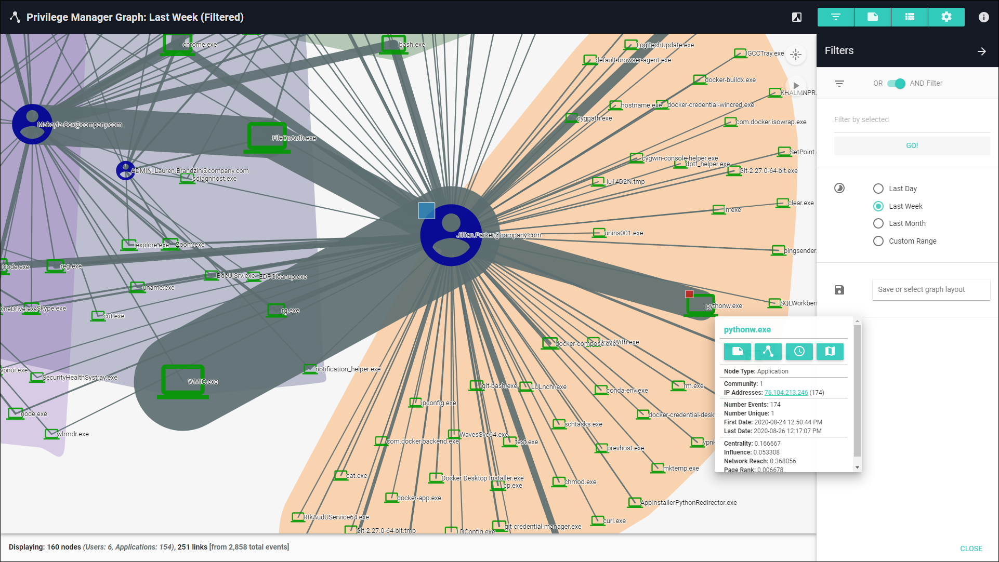

[title] # (Application Graph)
[tags] # (privilege manager)
[priority] # (4520)
# Application Graph

You are looking at a graph of Privilege Manager event data. The graph starts out showing clusters or "communities", which are a high-level organization of the nodes. The expanded view shows circles or "nodes", which represent Users and Applications. The lines or "links" show the number of events between Users and Applications.

* Click the Expand button (top right area of graph window) to see all individual nodes.
* Double-click on a community node to see the Users and Applications it contains.
* Drag nodes or the background to move elements around.
* Scroll up or down to zoom the graph view in or out.
* Right-click on nodes or links for more information.
* Click the Pause button to drag nodes and leave them in place.

Check out all the right-side menus for more features and options.

The "Filter by selected" input accepts "*" (wildcard) and uppercase "AND", "NOT", and "OR" searches (but no mixing AND, NOT, OR, nor parentheses).

All metadata are based on the latest update (even for past timeframes).

Timestamps are based on the Local Timezone in System Settings.

>**NOTE**: if no nodes appear, go to the Filters menu and try turning off filters.
