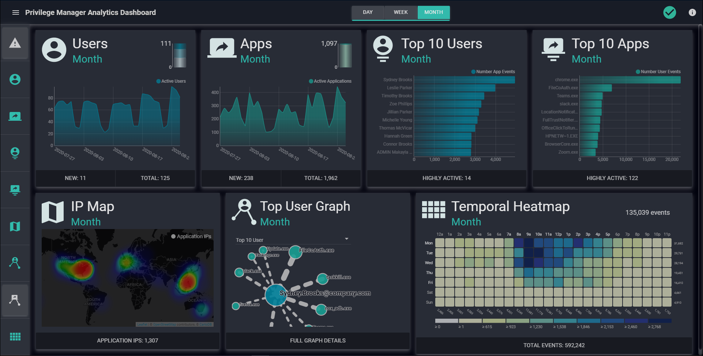

[title]: # (Dashboard)
[tags]: # (privilege manager)
[priority]: # (4510)

# Privilege Manager Operations Dashboard

The Dashboard contains high-level summaries and key metrics for Privilege Manager event data and Privileged Behavior Analytics.

* The menu (top left sub-bar) contains Dashboard layout and customization options.
* The Day, Week, Month buttons cycle by default but clicking one pauses or restarts the cycle.
* The left sidebar buttons turn on/off widget boxes on the dashboard.
* Any changes made to the dashboard layout are automatically saved for the next time you login.
* All metadata are based on the latest update, which might have a few minutes lag time.
* Timestamp displays are based on the Local Timezone and Hour Display in System Settings.
* The Alerts tile is currently only available for Secret Server. In the left sidebar, click the alert icon to toggle off the tile.

