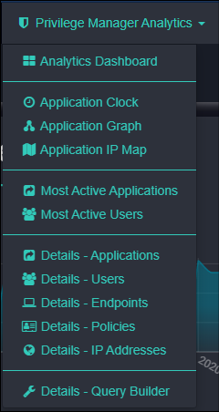

[title]: # (Privilege Manager Operations)
[tags]: # (Privilege Manager,Privileged Behavior Analytics,PBA,Operations)
[priority]: # (4500)

# PBA - Privilege Manager Operations

Once you have setup Privilege Manager and Privileged Behavior Analytics to work together, you can begin normal operations. During a typical session with PBA, you will use various tools, including the tools summarized in the table below.

>**Note**: If you are already using PBA for Secret Server, select the Privilege Manager Analytics menu. If you are using PBA for Privilege Manager only, your Privilege Manager Analytics Dashboard opens by default.

| Name | Description |
| ----- | ----- |
| [Analytics Dashboard](dashboard.md) | Displays several key indicators neatly assembled on quick-view tiles |
| [Application Clock](app-clock.md) | Displays temporal patterns and filters data by Application, User, Endpoint, Policy, and IP/location |
| [Application Graph](app-graph.md) | Shows users accessing applications, designed to reveal anomalous patterns |
| [Application IP Map](app-ipmap.md) | Maps out application activity, aggregated by IP address and location |
| [Most Active Applications](most-active-apps.md) | Reveals which applications have seen the most executions |
| [Most Active Users](most-active-users.md) | Identifies users accessing more applications than most other users |
| [Application Details](details-apps.md) | Runs down all recent access activity for specific applications and their characteristics |
| [User Details](details-users.md) | Allows you to explore in detail information collected about a specific user’s activity |
| [Endpoint Details](details-endpoints.md) | Summarizes endpoint activity by user and application |
| [Policy Details](details-policies.md) | Provides details about policies triggered by users accessing applications |
| [IP Address Details](details-ip-addresses.md) | Shows IP address activity summary and location information |
| [Query Builder](querybuilder.md) | Enables data query and export for criteria you specify |
