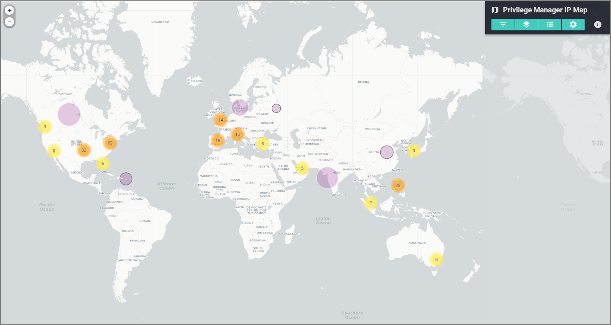

[title]: # (IP Map)
[tags]: # (privilege manager)
[priority]: # (4540)
# Privilege Manager IP Map Info

This is an IP address map of Privilege Manager event data. Use the buttons in the top right corner to access map menus. Point clusters and heatmap layers for Users and Applications can be toggled on/off from the Layers menu.

Click an individual point (circle without a number) to see details for an IP address. Points with a gray or black outline are located only to the region or country level, respectively.

Zoom in/out using the mouse wheel, buttons on the upper left, double-click (+ Shift), or drag the mouse while holding Shift to draw a box.

The "Filter by selected" input accepts "*" (wildcard) and uppercase "AND", "NOT", and "OR" searches (but no mixing AND, NOT, OR, nor parentheses).

All metadata are based on the latest update (even for past timeframes).

Timestamps are based on the Local Timezone in System Settings.

>**NOTE**: if no data appear, go to the Filters menu and try turning off filters.

## Stats

* Total Events: 39,705
* Unique IP Addresses: 223
* First Date: 2020-08-12 10:01:02 AM
* Last Date: 2020-08-19 10:01:01 AM
* Countries: 23  (See Table menu for details.)

## Disclaimers

IP address locations are prone to change and can be inaccurate and imprecise, sometimes located to only the region or country level. This app shows only the most recent available IP address location information, which might have been updated since the time an IP address was last accessed. Location data are derived from MaxMind's GeoLite2.
