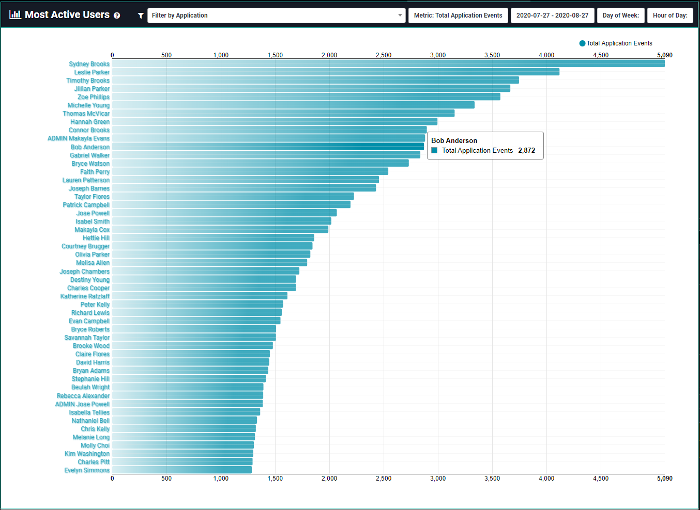

[title]: # (Most Active Users)
[tags]: # (Privilege Manager,Privileged Behavior Analytics,PBA,Operations,Most Active,Users)
[priority]: # (4560)

# Most Active Users

**Most Active Users** ranks the top 50 most active users for given filter criteria. To see this page, navigate to **Privilege Manager Analytics** or **Analytics** > **Most Active Users**.

The list contains the user display name and number of events for each of the top 50 users, using a bar chart as visual reference.

* By default, you will see the top 50 users in your Privilege Manager environment for the past month.
* You can further filter the list by an application, total or distinct accesses, or a specific timeframe.
* Clicking on a user name or bar in the list will take you to its **User Details** page.
